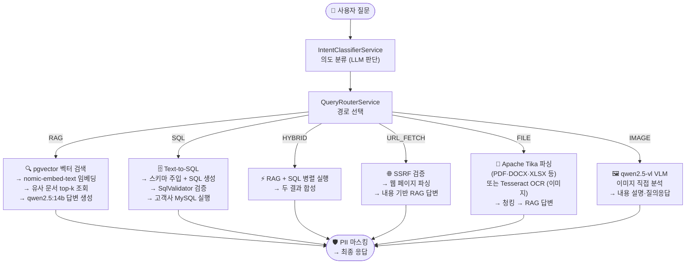
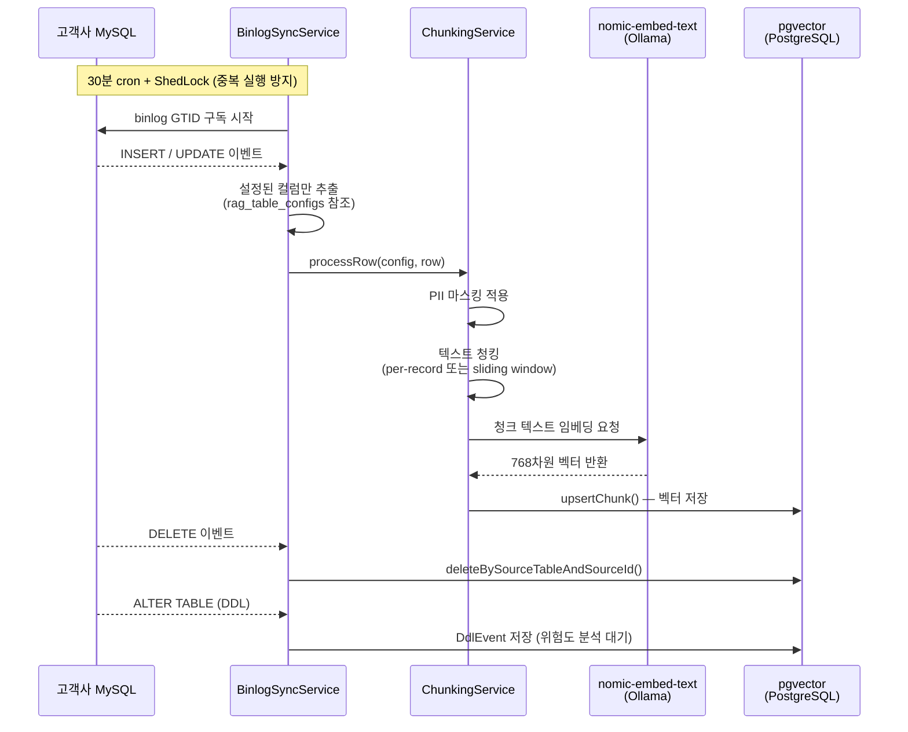
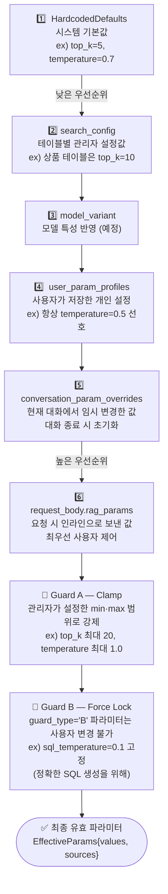
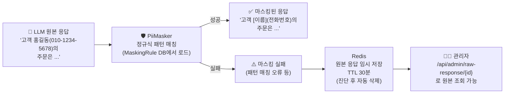
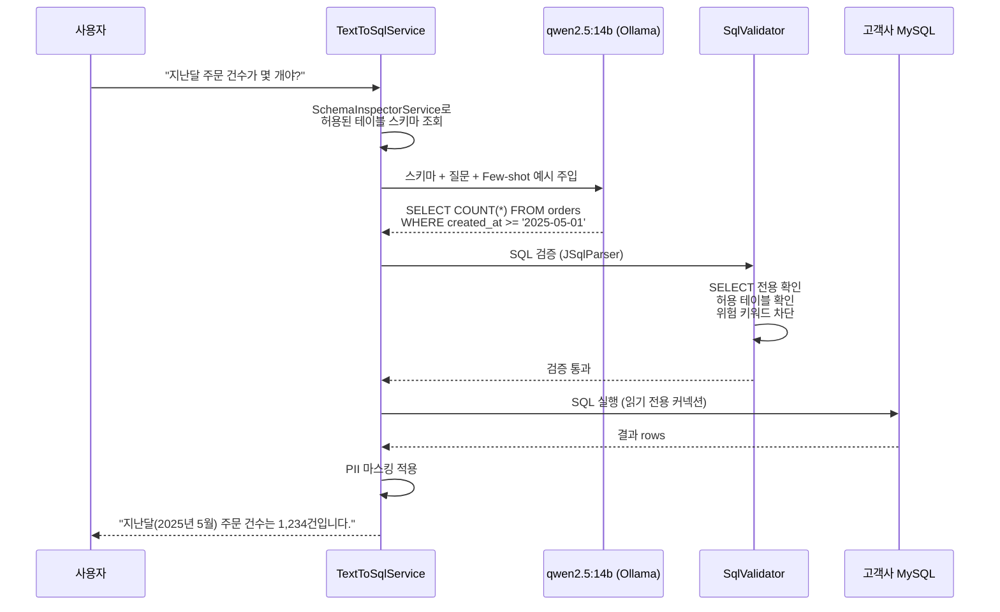
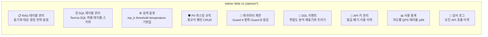
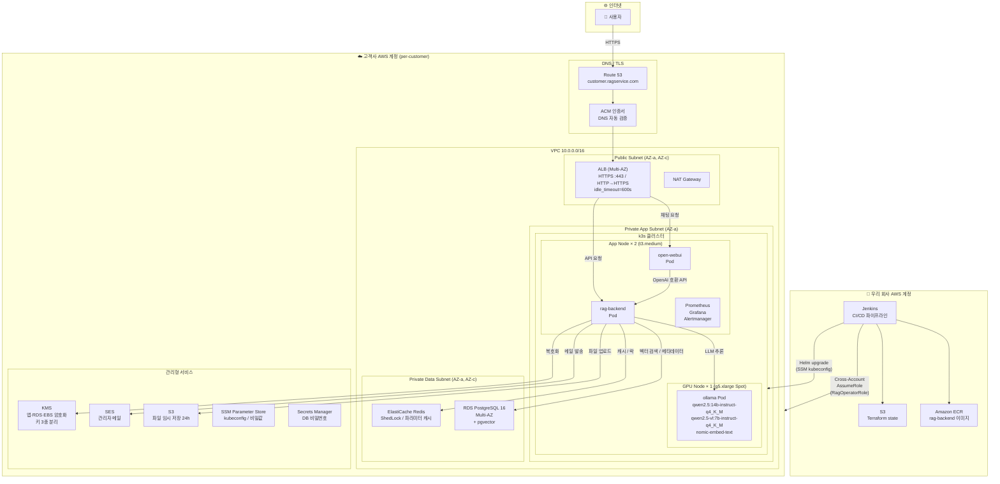
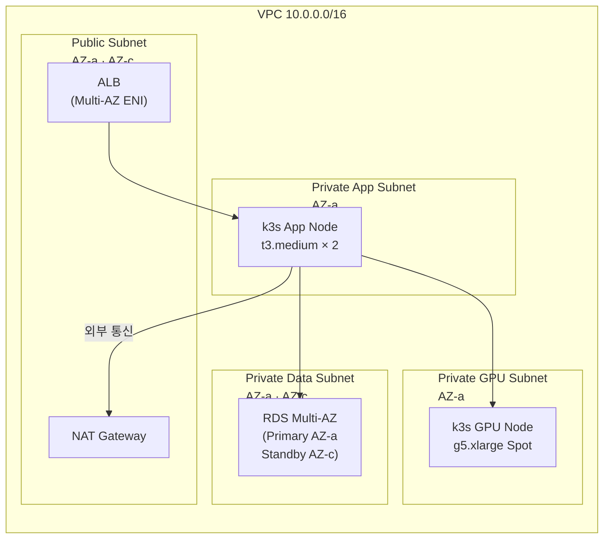
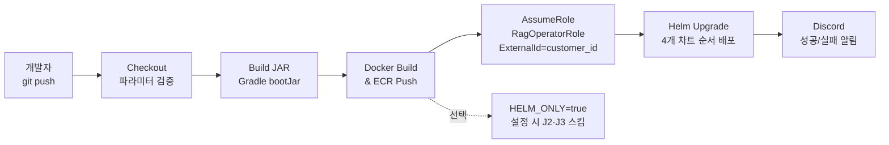

# RagVault

> 고객사 MySQL 데이터를 기반으로 자연어 RAG·SQL·혼합 질의응답을 제공하는 Spring Boot + Open WebUI + Ollama + pgvector SaaS.  
> **Dedicated Instance per Customer** — 고객사별 독립 AWS 계정 + k3s 클러스터.

---

## 목차

1. [시작하는 방법](#1-시작하는-방법)
2. [핵심 기능](#2-핵심-기능)
3. [전체 인프라 구조](#3-전체-인프라-구조)
4. [프로젝트별 아키텍처](#4-프로젝트별-아키텍처)
5. [아키텍처별 사용 스택](#5-아키텍처별-사용-스택)
6. [API 레퍼런스](#6-api-레퍼런스)
7. [데이터베이스 스키마](#7-데이터베이스-스키마)
8. [보안 모델](#8-보안-모델)
9. [모니터링](#9-모니터링)
10. [디렉토리 구조](#10-디렉토리-구조)

---

## 1. 시작하는 방법

### 사전 요구사항

| 도구 | 최소 버전 |
|------|-----------|
| Java | 21 |
| Docker + Docker Compose | 24+ |
| Node.js | 20+ |
| Helm | 3.14+ |
| Terraform | 1.5+ |

### 로컬 개발 환경 (Docker Compose)

```bash
# 1. 인프라 컨테이너 기동 (PostgreSQL + pgvector, Redis, Ollama, Open WebUI)
docker compose -f docker-compose.dev.yml up -d

# 2. Ollama 모델 Pull (첫 실행 시)
docker exec -it ollama ollama pull qwen2.5:14b-instruct-q4_K_M   # 채팅
docker exec -it ollama ollama pull qwen2.5-vl:7b-instruct-q4_K_M  # 멀티모달
docker exec -it ollama ollama pull nomic-embed-text               # 임베딩

# 3. Spring Boot 백엔드 실행
cd rag-backend
./gradlew bootRun

# 4. Open WebUI 프론트엔드 개발 서버 (포크 수정 시)
cd open-webui-fork
pip install -r backend/requirements.txt
cd frontend && npm install && npm run dev
```

| 엔드포인트 | URL |
|-----------|-----|
| Open WebUI (채팅 UI) | http://localhost:3000 |
| Spring Boot API | http://localhost:8080 |
| Admin Web UI | http://localhost:8080/admin/ |
| Ollama API | http://localhost:11434 |
| Prometheus Metrics | http://localhost:8080/actuator/prometheus |

### 프로덕션 배포 (신규 고객사)

```bash
# 1. Terraform — 고객사 인프라 프로비저닝
cd rag-infra/terraform/customers
cp -r template {customer_id}
cd {customer_id}
# terraform.tfvars.example 복사 후 편집
terraform init && terraform plan && terraform apply

# 2. Packer AMI 빌드 (Ollama + 모델 사전 탑재)
cd rag-infra/packer
packer init ollama-ami.pkr.hcl
packer build -var="subnet_id=<PUBLIC_SUBNET_ID>" ollama-ami.pkr.hcl

# 3. Helm 차트 배포 (Jenkins 파이프라인 또는 수동)
helm upgrade --install rag-backend ./rag-infra/helm/rag-backend \
  --namespace rag-system --create-namespace \
  -f ./rag-infra/helm/rag-backend/values-prod.yaml --wait

helm upgrade --install ollama ./rag-infra/helm/ollama \
  --namespace rag-system -f ./rag-infra/helm/ollama/values-prod.yaml --wait

helm upgrade --install open-webui ./rag-infra/helm/open-webui \
  --namespace rag-system -f ./rag-infra/helm/open-webui/values-prod.yaml --wait

helm upgrade --install monitoring prometheus-community/kube-prometheus-stack \
  --namespace monitoring --create-namespace \
  -f ./rag-infra/helm/monitoring/values.yaml --wait
```

---

## 2. 핵심 기능

### 2-1. 질의 의도 분류 — 6가지 경로

사용자가 질문을 입력하면 시스템이 그 의도를 자동으로 파악하고, 질문의 성격에 맞는 처리 경로로 보낸다.  
예를 들어 "이 고객의 주문 수는?"처럼 수치 조회가 필요한 질문은 SQL 경로로, "반품 정책이 어떻게 돼요?"처럼 문서 검색이 필요한 질문은 RAG 경로로 자동 분기된다.



| Intent | 언제 선택되나 | 예시 질문 |
|--------|-------------|----------|
| `RAG` | 문서·정책·설명 등 비정형 텍스트 검색 | "반품 정책이 어떻게 되나요?" |
| `SQL` | 수치·집계·필터링 등 정형 데이터 조회 | "지난달 주문 건수가 몇 개야?" |
| `HYBRID` | 문서 맥락 + 수치 데이터 동시 필요 | "VIP 고객의 반품율과 환불 정책은?" |
| `URL_FETCH` | URL을 직접 첨부한 질문 | "이 링크 내용 요약해줘: https://..." |
| `FILE` | 파일을 첨부한 질문 | (PDF/DOCX/이미지 첨부 후 질문) |
| `IMAGE` | 이미지만 첨부하거나 이미지 분석 요청 | "이 스크린샷에서 오류 찾아줘" |

---

### 2-2. 데이터 동기화 — MySQL Binlog 자동 반영

고객사 MySQL DB의 데이터가 바뀌면 **자동으로** RAG 검색 인덱스에 반영된다.  
관리자가 수동으로 데이터를 옮길 필요 없이, MySQL의 변경 이력(binlog)을 구독해서 실시간에 가깝게 동기화한다.



**동기화 흐름 핵심 포인트**
- **GTID 모드**: MySQL 서버에서 GTID가 활성화되어 있어야 한다. binlog 중단 후 재개 시 정확히 이전 위치부터 이어서 처리.
- **중복 방지**: ShedLock이 Redis를 이용해 분산 환경에서 동일 작업이 두 번 실행되는 것을 막는다.
- **DDL 안전망**: `ALTER TABLE`이나 `DROP TABLE` 감지 시 자동으로 `DdlEvent`를 기록하고 Admin UI에 위험도(LOW/MEDIUM/HIGH)를 표시한다. 관리자가 확인 후 재동기화 여부를 결정한다.
- **초기 동기화**: 신규 테이블 등록 시 `InitialSyncService`가 전체 스냅샷을 먼저 일괄 처리한다.

---

### 2-3. 파라미터 7단계 우선순위 체인

RAG 검색 품질을 결정하는 파라미터(검색 범위, 온도, 최대 토큰 수 등)는 **7단계 우선순위**로 결정된다.  
우선순위가 낮은 단계의 값은 높은 단계가 덮어쓴다. 마지막에 Guard(가드레일)가 범위를 강제한다.



**주요 파라미터 목록**

| 파라미터 | 기본값 | 설명 |
|----------|--------|------|
| `top_k` | 5 | 벡터 검색 시 가져올 문서 수 |
| `similarity_threshold` | 0.65 | 유사도 최소 기준값 (이 이하는 무시) |
| `temperature` | 0.7 | LLM 답변 창의성 (0=일정, 1=다양) |
| `max_tokens` | 2000 | 답변 최대 길이 |
| `sql_temperature` | 0.1 🔒 | SQL 생성 온도 (Guard B 고정) |
| `max_context_tokens` | 5000 🔒 | 컨텍스트 최대 토큰 (Guard B 고정) |
| `force_path` | AUTO | 강제 경로 지정 (RAG/SQL/HYBRID/AUTO) |
| `max_history_turns` | 10 | 대화 히스토리 최대 턴 수 |

> 🔒 Guard B 파라미터는 관리자만 변경 가능. 사용자 요청으로 덮어쓰기 불가.

- 결과는 Redis에 캐시: `param:{userEmail}:{conversationId}` — TTL 5분
- 응답에 `sources` 맵 포함 — 각 파라미터가 몇 단계에서 결정됐는지 추적 가능

---

### 2-4. PII 마스킹 — 개인정보 자동 차단

LLM이 응답을 생성하더라도, **최종적으로 사용자에게 전달되기 전** 반드시 PII 마스킹을 거친다.  
개인정보가 포함된 응답이 외부로 노출되는 것을 시스템 레벨에서 차단한다.



**마스킹 규칙 관리**

관리자가 Admin Web UI에서 정규식 패턴을 등록·수정하면 즉시 적용된다.

| 기본 제공 패턴 | 예시 |
|---------------|------|
| 한국 전화번호 | `010-1234-5678` → `[전화번호]` |
| 이메일 주소 | `user@email.com` → `[이메일]` |
| 주민등록번호 | `901231-1234567` → `[주민번호]` |
| 신용카드 번호 | `1234-5678-1234-5678` → `[카드번호]` |

---

### 2-5. Text-to-SQL — 자연어로 DB 직접 조회

사용자가 SQL을 몰라도, 자연어 질문만으로 고객사 MySQL DB를 조회할 수 있다.  
단, **SELECT만 허용**하고 데이터 변경(INSERT/UPDATE/DELETE)은 시스템 레벨에서 완전 차단한다.



---

### 2-6. 멀티모달 처리 — 파일·이미지·URL

**파일 업로드**
- PDF, DOCX, XLSX, PPTX, TXT, CSV → Apache Tika로 텍스트 추출
- 이미지 파일(PNG, JPG, TIFF) → Tesseract OCR로 텍스트 추출
- 추출된 텍스트는 청킹 후 임시 RAG 컨텍스트로 사용됨 (대화 내 한정)
- 원본 파일은 S3에 24시간 임시 저장 후 자동 삭제

**URL 첨부**
- SSRF 방어 (`SsrfGuard`): 내부망 IP·AWS 메타데이터 주소 자동 차단
- `Readability4j`로 웹 페이지 본문만 추출 (광고·네비게이션 제거)
- 추출된 내용을 컨텍스트로 RAG 검색 보완

**이미지 분석**
- `qwen2.5-vl:7b-instruct-q4_K_M` (Vision-Language Model)
- 이미지 내 텍스트 인식, 차트 분석, 오류 화면 설명 등

---

### 2-7. Admin Web UI

Spring Boot가 직접 서빙하는 SPA (`/admin/*`). 별도 서버나 빌드 없이 바로 사용 가능하다.



| 메뉴 | 주요 기능 | 비고 |
|------|-----------|------|
| RAG 테이블 관리 | 동기화 대상 테이블·컬럼, 청킹 전략(per-record/sliding-window), PII 레벨 | 설정 저장 시 초기 동기화 자동 트리거 |
| SQL 테이블 관리 | Text-to-SQL 허용 테이블, 스키마 설명, few-shot 예시 등록 | 허용 목록 외 테이블은 SQL 실행 불가 |
| 검색 설정 | 테이블별 top_k, similarity_threshold, temperature 기본값 | Stage 2 파라미터 소스 |
| PII 마스킹 규칙 | 정규식 패턴 CRUD, 마스킹 레벨(standard/strict) | 저장 즉시 전체 경로 적용 |
| 파라미터 제한 | Guard A: min/max 범위, Guard B: 잠금(🔒)/해제(🔓) + 고정값·잠금 사유 | Guard B 해제는 관리자 전용 |
| DDL 이벤트 | DDL 이력, 위험도 분석(컬럼 삭제=HIGH 등), 수동 재동기화 트리거 | HIGH는 관리자 수동 확인 필수 |
| API 키 관리 | 키 발급(bcrypt 해시 저장), 폐기, 마지막 사용 시각 확인 | 키는 발급 시 한 번만 평문 노출 |
| 사용 통계 | 의도별 요청 수, 에러율, 응답시간 히스토리 | Prometheus 메트릭 기반 |
| 감사 로그 | 모든 API 호출 (사용자·엔드포인트·응답코드·소요시간) | 보안 감사 목적 |

---

## 3. 전체 인프라 구조

고객사마다 **독립된 AWS 계정**에 전용 인프라가 프로비저닝된다 (Dedicated Instance per Customer).  
우리 회사 Jenkins가 Cross-Account Role을 통해 고객사 계정에 배포하는 구조.

### 전체 구성도



---

### 네트워크 계층 상세



---

### 배포 파이프라인



---

### AWS 리소스 요약

| 분류 | 리소스 | 스펙 / 설정 |
|------|--------|------------|
| **컴퓨트** | EC2 App Node | t3.medium × 2, Private Subnet |
| **컴퓨트** | EC2 GPU Node | g5.xlarge Spot (A10G 24GB VRAM), Spot 중단 핸들러 내장 |
| **DB** | RDS PostgreSQL 16 | Multi-AZ, pgvector 확장, Secrets Manager 비밀번호 |
| **캐시** | ElastiCache Redis | ShedLock 분산 락 + 파라미터 캐시(TTL 5분) |
| **로드밸런서** | ALB | Multi-AZ, idle_timeout=600s, HTTPS 강제 |
| **DNS/TLS** | Route 53 + ACM | DNS 검증 자동화, `create_before_destroy` |
| **스토리지** | S3 | 파일 업로드 임시 저장 (24h TTL) |
| **암호화** | KMS | 앱 데이터·RDS·EBS 용도별 키 3개 분리 |
| **비밀값** | Secrets Manager + SSM | DB 비밀번호 / kubeconfig·운영 파라미터 |
| **메일** | SES | 관리자 계정 발급·비밀번호 재설정 메일 |
| **모니터링** | kube-prometheus-stack | Prometheus + Grafana + Alertmanager (Discord 알림) |

---

## 4. 프로젝트별 아키텍처

### 4-1. `rag-backend` — Spring Boot API

```
HTTP 요청 (Open WebUI → OpenAI 호환 API)
    │
    ├── TrustedHeaderFilter       X-User-Email 헤더 신뢰 경계 검증
    ├── ApiKeyAuthFilter          API Key 인증
    └── AdminSessionFilter        /admin/* 세션 인증
    │
    ▼
ChatController  POST /v1/chat/completions
    │
    ├── ParameterResolver         7단계 파라미터 병합
    │   └── ParameterCacheService Redis 캐시 (TTL 5분)
    │
    ├── IntentClassifierService   의도 분류 (RAG/SQL/HYBRID/URL/FILE/IMAGE)
    │
    └── QueryRouterService        경로별 처리
        ├── RagService            pgvector 유사도 검색 → Ollama Chat
        ├── TextToSqlService      스키마 → SQL 생성 → 검증 → 실행
        ├── HybridQueryService    RAG + SQL 병렬 → 합성
        ├── UrlFetchService       SSRF 검증 → 파싱 → RAG
        ├── FileProcessingService Tika / Tesseract OCR → 청킹 → RAG
        └── (VLM direct)         qwen2.5-vl → 이미지 답변
            │
            └── PiiMasker        모든 응답에 PII 마스킹 적용

데이터 동기화 (비동기 스케줄)
    BinlogSyncService ──▶ ChunkingService ──▶ DocumentChunkRepository (pgvector)
    └── ShedLock (Redis)    PiiMasker 적용         nomic-embed-text 임베딩
```

**주요 서비스 목록**

| 서비스 | 역할 |
|--------|------|
| `IntentClassifierService` | 6가지 의도 분류 |
| `ParameterResolver` | 7단계 파라미터 우선순위 체인 |
| `BinlogSyncService` | MySQL binlog 구독·이벤트 처리 |
| `ChunkingService` | 텍스트 청킹·임베딩·pgvector upsert |
| `TextToSqlService` | 자연어 → SQL 생성 |
| `SqlExecutorService` | SQL 실행·결과 PII 마스킹 |
| `RagService` | pgvector 벡터 검색 + Ollama Chat |
| `HybridQueryService` | RAG + SQL 병렬 실행·합성 |
| `UrlFetchService` | URL 콘텐츠 추출 (SSRF 방어 포함) |
| `FileProcessingService` | 파일 파싱·OCR |
| `PiiMasker` | 정규식 기반 PII 마스킹 |
| `DdlAnalysisService` | DDL 위험도 분석 (LOW/MEDIUM/HIGH) |
| `RagMetricsService` | Prometheus 커스텀 메트릭 |

**Flyway 마이그레이션**

```
V1  — 기본 스키마 (api_keys, audit_log, masking_rules)
V2  — RAG 테이블 설정 (rag_table_configs, document_chunks, binlog_position)
V3  — SQL 테이블 설정 (sql_table_configs)
V4  — 검색 설정 (search_configs)
V5  — 파일 처리 (file_processings)
V6  — 파라미터 제한 초기값 (admin_param_limits)
V7  — DDL 이벤트 (ddl_events)
V8  — pgvector extension + HNSW 인덱스
V9  — 동기화 작업 이력 (sync_jobs)
V10 — 파라미터 튜닝 스키마 (user_param_profiles, conversation_param_overrides, Guard B 초기값)
```

---

### 4-2. `open-webui-fork` — 채팅 프론트엔드

Open WebUI를 포크하여 커스텀 기능을 추가. 업스트림 변경 최소화 원칙.

```
사용자 브라우저
    │
    └── Open WebUI (Svelte + Python Backend)
        │
        ├── 커스텀 컴포넌트
        │   ├── ParameterPanel.svelte    파라미터 튜닝 사이드 패널
        │   ├── ParameterSlider.svelte   슬라이더 + 숫자 입력 (잠금 상태 표시)
        │   └── ParameterRadio.svelte    라디오 그룹 선택
        │
        ├── MessageInput.svelte          rag_params 포함하여 요청 전송
        └── Settings/Sidebar.svelte      ParameterPanel 마운트 포인트
        │
        ▼ OpenAI 호환 API
    rag-backend POST /v1/chat/completions
        └── body.rag_params: { top_k, temperature, force_path, ... }
```

**포크 변경 파일 목록**

| 파일 | 변경 내용 |
|------|-----------|
| `frontend/src/lib/components/custom/ParameterPanel.svelte` | 신규 — 5개 섹션 파라미터 조작 패널 |
| `frontend/src/lib/components/custom/ParameterSlider.svelte` | 신규 — 슬라이더 컴포넌트 |
| `frontend/src/lib/components/custom/ParameterRadio.svelte` | 신규 — 라디오 그룹 컴포넌트 |
| `frontend/src/lib/components/chat/Settings/Sidebar.svelte` | 수정 — ParameterPanel 임포트 |
| `frontend/src/lib/components/chat/MessageInput.svelte` | 수정 — `ragParams` prop → 요청 body 포함 |

---

### 4-3. `rag-infra` — Infrastructure as Code

```
rag-infra/
├── terraform/
│   ├── modules/rag-stack/     재사용 가능한 고객사 인프라 모듈
│   │   ├── vpc.tf             VPC + 7개 서브넷 + NAT GW
│   │   ├── alb.tf             ALB Multi-AZ (idle_timeout=600)
│   │   ├── ec2.tf             k3s App Node ×2 + GPU Spot Node
│   │   ├── rds.tf             RDS PostgreSQL Multi-AZ
│   │   ├── route53.tf         ACM 인증서 + DNS 검증 + A 레코드
│   │   ├── iam.tf             Jenkins Cross-Account Role, Instance Profile
│   │   ├── kms.tf             앱·RDS·EC2 EBS 암호화 키
│   │   ├── ses.tf             SES 발신 도메인 검증
│   │   ├── sg.tf              보안 그룹 (ALB·App·GPU·RDS)
│   │   └── cloudwatch.tf      CloudWatch 로그 그룹
│   └── customers/template/    신규 고객사 배포 템플릿
│       ├── main.tf            모듈 호출 + Cross-Account Provider
│       └── variables.tf       고객사별 변수
│
├── helm/
│   ├── rag-backend/           Spring Boot Helm 차트
│   ├── open-webui/            Open WebUI Helm 차트
│   ├── ollama/                Ollama Helm 차트 (GPU nodeSelector)
│   └── monitoring/            kube-prometheus-stack values
│       └── values.yaml        Prometheus scrape + Grafana 대시보드 2종 + Alertmanager Discord
│
├── packer/
│   └── ollama-ami.pkr.hcl     AL2023 + Ollama + 모델 3종 사전 탑재 AMI
│
└── Jenkinsfile                Cross-Account 배포 파이프라인 (5단계)
```

**Packer AMI 사전 탑재 모델**

| 모델 | 용도 | 양자화 |
|------|------|--------|
| `qwen2.5:14b-instruct-q4_K_M` | 채팅·RAG·SQL 생성 | Q4_K_M |
| `qwen2.5-vl:7b-instruct-q4_K_M` | 이미지 분석 (VLM) | Q4_K_M |
| `nomic-embed-text` | 텍스트 임베딩 (768차원) | — |

> **ADR-0004**: 모든 환경에서 Q4_K_M 양자화 통일. 모델 크기·응답 품질 균형점.

**Jenkins 파이프라인 스테이지**

```
Checkout → Build JAR → Docker Build & Push (ECR) → AssumeRole → Helm Upgrade
```

- `HELM_ONLY=true` 파라미터로 이미지 빌드 없이 Helm만 재배포 가능
- kubeconfig는 SSM Parameter Store `/rag/{CUSTOMER_ID}/kubeconfig`에서 취득
- 배포 완료·실패 시 Discord Embed 알림

---

## 5. 아키텍처별 사용 스택

### rag-backend

| 분류 | 라이브러리 / 기술 | 버전 |
|------|------------------|------|
| **Runtime** | Java | 21 |
| **Framework** | Spring Boot | 3.5.0 |
| **AI** | Spring AI (Ollama) | 1.0.0 |
| **Vector DB** | PostgreSQL + pgvector | 16 + 0.8.x |
| **ORM** | Spring Data JPA + Hibernate | — |
| **Migration** | Flyway | — |
| **Cache** | Spring Data Redis | — |
| **Distributed Lock** | ShedLock (Redis provider) | 5.16.0 |
| **Security** | Spring Security 6 | — |
| **Binlog** | mysql-binlog-connector-java | 0.29.2 |
| **MySQL JDBC** | mysql-connector-j | 9.3.0 |
| **Text Splitting** | LangChain4j | 0.36.2 |
| **SQL Parsing** | JSqlParser | 4.9 |
| **URL Fetch** | Readability4j + Jsoup | 1.0.8 / 1.18.3 |
| **File Parsing** | Apache Tika | 2.9.2 |
| **OCR** | Tess4j (Tesseract) | 5.12.0 |
| **Storage** | AWS SDK v2 S3 | 2.25.60 |
| **Mail** | Spring Mail + Thymeleaf | — |
| **Metrics** | Micrometer + Prometheus | — |
| **Test** | JUnit 5 + Mockito + H2 | — |
| **Util** | Lombok | — |

### open-webui-fork

| 분류 | 기술 |
|------|------|
| **Frontend** | Svelte 4 + TypeScript |
| **Build** | Vite |
| **Backend** | Python (FastAPI) — Open WebUI 원본 |
| **통신** | OpenAI 호환 REST API |

### rag-infra

| 분류 | 기술 / 버전 |
|------|------------|
| **IaC** | Terraform ≥ 1.5, AWS Provider ~> 5.0 |
| **Container Orchestration** | k3s |
| **Helm** | ≥ 3.14 |
| **AMI Build** | Packer (amazon-ebs) |
| **CI/CD** | Jenkins (Declarative Pipeline) |
| **Registry** | Amazon ECR |
| **Compute** | EC2 t3.medium (App) / g5.xlarge Spot (GPU) |
| **Database** | Amazon RDS PostgreSQL 16 Multi-AZ |
| **Cache** | Amazon ElastiCache Redis |
| **Storage** | Amazon S3 |
| **DNS + TLS** | Route 53 + ACM (DNS 검증 자동화) |
| **Secret** | AWS Secrets Manager + SSM Parameter Store |
| **Encryption** | AWS KMS (앱 데이터 / RDS / EBS 각각 별도 키) |
| **Mail** | Amazon SES |
| **Monitoring** | kube-prometheus-stack (Prometheus + Grafana + Alertmanager) |
| **Alert** | Discord Webhook (Critical / Warning 채널 분리) |

### Ollama 모델 서버

| 분류 | 내용 |
|------|------|
| **서버** | Ollama (latest) |
| **배포** | GPU Node 단독 Pod (Recreate 전략) |
| **노드** | g5.xlarge Spot (NVIDIA A10G, 24GB VRAM) |
| **스토리지** | PVC 100Gi (gp3) — `/root/.ollama` 모델 저장 |
| **병렬 처리** | `OLLAMA_NUM_PARALLEL=2`, `OLLAMA_MAX_LOADED_MODELS=2` |

---

## 6. API 레퍼런스

### 채팅 (OpenAI 호환)

```http
POST /v1/chat/completions
Authorization: Bearer <API_KEY>
X-User-Email: user@example.com   (Open WebUI 백엔드 주입)

{
  "model": "qwen2.5:14b-instruct-q4_K_M",
  "messages": [{ "role": "user", "content": "..." }],
  "stream": true,
  "rag_params": {               // 선택 — Stage 6 인라인 파라미터
    "top_k": 5,
    "temperature": 0.7,
    "force_path": "RAG"
  }
}
```

### 사용자 파라미터 프로파일

```http
GET    /api/v1/user/param-profile           # 저장된 프로파일 조회
PUT    /api/v1/user/param-profile           # 프로파일 저장
DELETE /api/v1/user/param-profile           # 프로파일 초기화

PUT    /api/v1/conversations/{id}/params    # 대화별 임시 오버라이드
DELETE /api/v1/conversations/{id}/params    # 오버라이드 해제
GET    /api/v1/params/effective             # 현재 유효 파라미터 확인 (출처 포함)
```

### 파일 업로드

```http
POST /api/v1/files/upload
Content-Type: multipart/form-data
# 지원 형식: PDF, DOCX, XLSX, PPTX, TXT, CSV, PNG, JPG, TIFF
```

### Admin API

```http
# RAG 테이블 관리
GET|POST|PUT|DELETE /api/admin/rag-tables

# SQL 테이블 관리
GET|POST|PUT|DELETE /api/admin/sql-tables

# 검색 설정
GET|POST|PUT /api/admin/search-configs

# 파라미터 제한 (Guard A/B)
GET    /api/admin/param-limits
PUT    /api/admin/param-limits/{name}/lock     # Guard B 잠금
PUT    /api/admin/param-limits/{name}/unlock   # Guard B 해제

# DDL 이벤트
GET    /api/admin/ddl-events
GET    /api/admin/ddl-events/{id}/analysis     # 위험도 분석
POST   /api/admin/ddl-events/{id}/trigger      # 수동 재동기화

# 동기화 제어
POST   /api/admin/sync/trigger                 # 즉시 동기화

# PII 원본 응답 (마스킹 실패 진단)
GET    /api/admin/raw-response/{sessionId}     # Redis TTL 30분
```

---

## 7. 데이터베이스 스키마

### 주요 테이블

```
document_chunks           — pgvector 임베딩 청크 (768차원 HNSW 인덱스)
rag_table_configs         — 동기화 대상 테이블 설정 (청킹 전략·PII 레벨·컬럼 목록)
sql_table_configs         — Text-to-SQL 허용 테이블·스키마 정보
search_configs            — 테이블별 검색 파라미터 기본값
admin_param_limits        — Guard A 범위 / Guard B 잠금 파라미터
user_param_profiles       — 사용자별 파라미터 프로파일 (JSONB)
conversation_param_overrides — 대화별 임시 파라미터 오버라이드 (JSONB)
masking_rules             — PII 마스킹 정규식 패턴
binlog_position           — MySQL binlog GTID 재개 위치
binlog_events             — 처리된 binlog 이벤트 이력
ddl_events                — DDL 변경 이력 + 위험도
sync_jobs                 — 동기화 작업 이력
api_keys                  — API 키 (bcrypt 해시 저장)
audit_log                 — 모든 API 호출 감사 이력
file_processings          — 파일 업로드·파싱 상태 추적
```

---

## 8. 보안 모델

| 계층 | 구현 |
|------|------|
| **인증** | API Key (`ApiKeyAuthFilter`) — bcrypt 해시 검증 |
| **Admin 인증** | 세션 기반 (`AdminSessionFilter`) |
| **사용자 식별** | `X-User-Email` 헤더 — Open WebUI 백엔드 주입, `TrustedHeaderFilter`로 경계 검증 |
| **PII 마스킹** | 모든 LLM 응답 경로 적용 (ADR-0008) |
| **SQL 안전** | `SqlValidator` — SELECT 전용 허용, DML/DDL 차단, JSqlParser 파싱 |
| **SSRF 방어** | `SsrfGuard` — 내부 IP·메타데이터 주소 차단 |
| **입력 검증** | `InputValidator` — 프롬프트 인젝션 패턴 탐지 |
| **암호화 저장** | KMS 키 3종 분리 (앱 데이터 / RDS / EBS) |
| **IMDSv2** | EC2 메타데이터 토큰 필수 (`http_tokens=required`) |
| **최소 권한 IAM** | Jenkins Cross-Account Role, EC2 Instance Profile 별도 분리 |

---

## 9. 모니터링

### 커스텀 Prometheus 메트릭

| 메트릭 | 타입 | 설명 |
|--------|------|------|
| `rag_query_total` | Counter | 의도별 총 요청 수 |
| `rag_query_errors_total` | Counter | 의도별 에러 수 |
| `rag_query_duration_seconds` | Histogram | 응답 시간 분포 |
| `rag_binlog_lag_seconds` | Gauge | binlog 처리 지연 |
| `rag_guardrail_triggered_total` | Counter | 가드레일 발동 수 |
| `rag_pii_masked_total` | Counter | PII 마스킹 건수 |
| `rag_query_blocked_total` | Counter | 보안 차단 건수 |

### Grafana 대시보드

- **RAG 메인**: QPS, 에러율, p99 응답시간, binlog 지연, 가드레일, PII 마스킹
- **RAG 인프라**: PostgreSQL 연결 수, Redis 메모리 사용률, JVM Heap

### Alertmanager

- Discord Critical / Warning 채널 분리
- `resolve_timeout: 5m`, `repeat_interval: 12h`

---

## 10. 디렉토리 구조

```
ragvault/
├── rag-backend/                         Spring Boot 백엔드
│   ├── src/main/java/com/ragservice/rag/
│   │   ├── config/                      AiConfig, SecurityConfig, SyncConfig ...
│   │   ├── controller/                  Chat, Admin*, UserParam, ConversationParam ...
│   │   ├── domain/                      JPA 엔티티
│   │   ├── dto/                         요청·응답 DTO
│   │   ├── filter/                      ApiKeyAuth, TrustedHeader, AdminSession
│   │   ├── repository/                  Spring Data JPA 리포지토리
│   │   ├── security/                    PiiMasker, SsrfGuard, InputValidator
│   │   └── service/                     비즈니스 로직 (30개 서비스)
│   └── src/main/resources/
│       ├── db/migration/                Flyway V1~V10
│       └── static/admin/               Admin Web UI SPA (index.html)
│
├── open-webui-fork/                     Open WebUI 포크
│   ├── backend/                         Python FastAPI (원본 유지)
│   └── frontend/src/lib/components/
│       └── custom/                      ParameterPanel, ParameterSlider, ParameterRadio
│
├── rag-infra/                           인프라 코드
│   ├── terraform/
│   │   ├── modules/rag-stack/           VPC, ALB, EC2, RDS, Route53+ACM, IAM, KMS ...
│   │   └── customers/template/          신규 고객사 배포 템플릿
│   ├── helm/
│   │   ├── rag-backend/                 Spring Boot Helm 차트
│   │   ├── open-webui/                  Open WebUI Helm 차트
│   │   ├── ollama/                      Ollama Helm 차트 (GPU 배포)
│   │   └── monitoring/                  kube-prometheus-stack values
│   ├── packer/
│   │   └── ollama-ami.pkr.hcl           Ollama + 모델 사전 탑재 AMI
│   └── Jenkinsfile                      Cross-Account 배포 파이프라인
│
├── requirements/                        요구사항 문서 (권위 출처)
│   ├── 01-architecture.md
│   ├── 02-stack-reference.md
│   ├── 03-data-sync-pipeline.md
│   ├── 04-rag-search-strategy.md
│   ├── 05-prompt-design.md
│   ├── 06-error-handling.md
│   ├── 07-auth-security.md
│   ├── 08-text-to-sql.md
│   ├── 09-user-parameter-tuning.md
│   └── 10-multimodal-files-url.md
│
├── docs/
│   ├── adr/                             Architecture Decision Records (ADR-0001 ~ 0010)
│   ├── lessons-learned/                 에러 기록·재발 방지
│   └── policies/                        팀·결정·보안·엔지니어링 정책
│
└── CLAUDE.md                            AI 에이전트 진입점 (정책 인덱스)
```

---

## 라이선스

| 모델 | 라이선스 |
|------|---------|
| Qwen2.5-14B / VL-7B | Apache 2.0 (상업 사용 가능) |
| nomic-embed-text | Apache 2.0 |

> Phase 2+에서 32B/72B 모델 도입 시 라이선스 재확인 필요.
