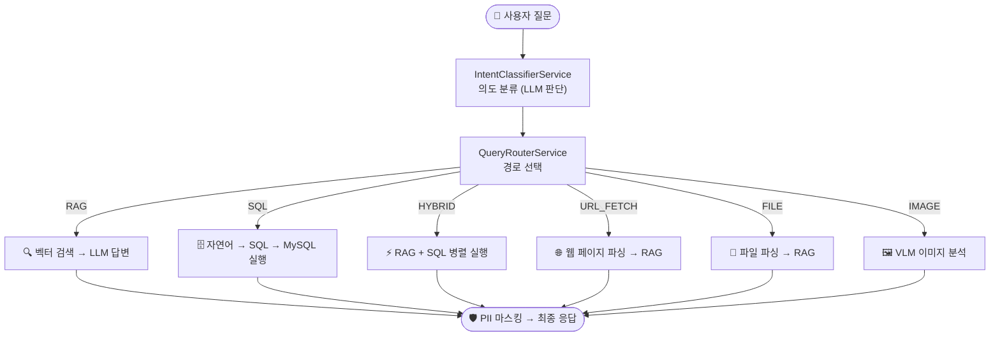
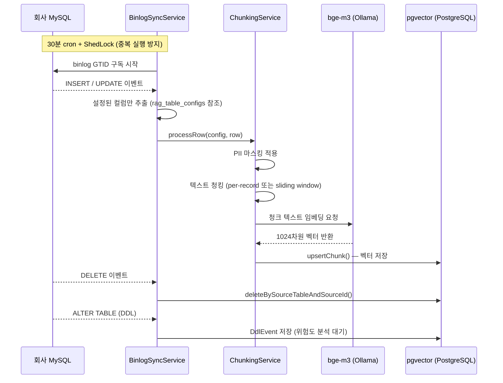
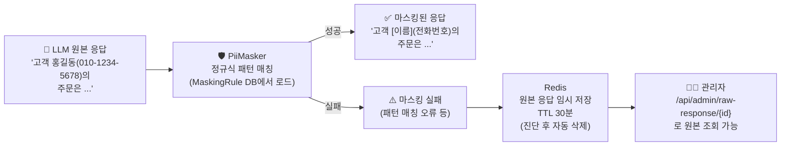
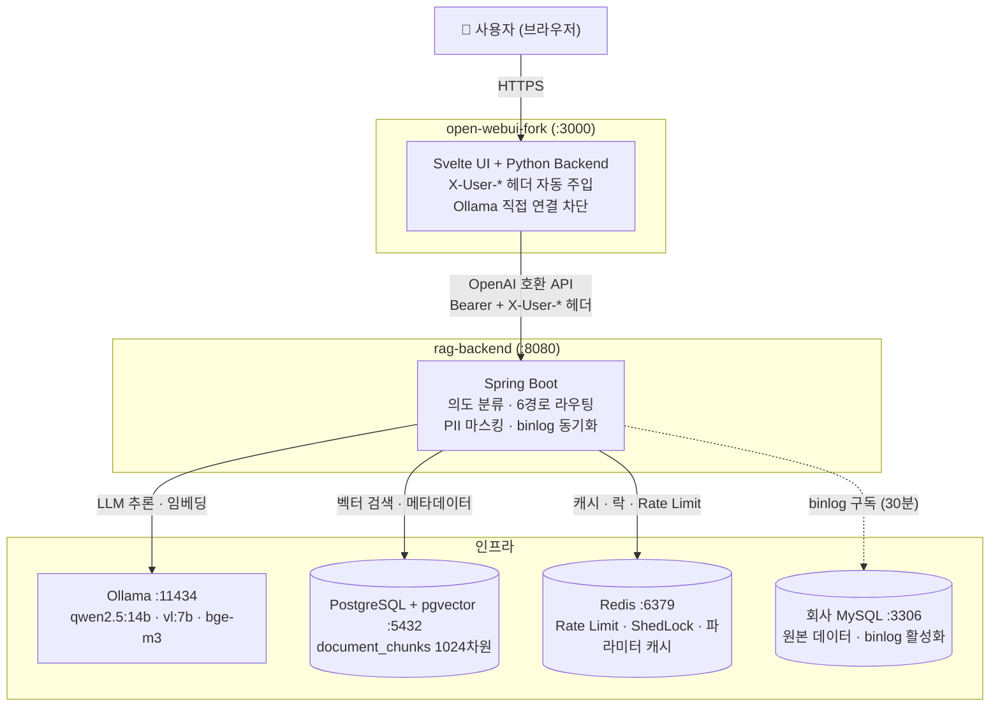

# RagVault

> MySQL 데이터를 기반으로 자연어 RAG·SQL·혼합 질의응답을 제공하는 Spring Boot + Open WebUI + Ollama + pgvector 사내 서비스.

---

## 목차

1. [시작하는 방법](#1-시작하는-방법)
2. [핵심 기능](#2-핵심-기능)
3. [아키텍처 설계](#3-아키텍처-설계)
4. [프로젝트별 아키텍처](#4-프로젝트별-아키텍처)
5. [아키텍처별 사용 스택](#5-아키텍처별-사용-스택)
6. [데이터베이스 스키마](#6-데이터베이스-스키마)
7. [보안 모델](#7-보안-모델)
8. [모니터링](#8-모니터링)

---

## 1. 시작하는 방법

### 사전 요구사항

| 도구                    | 최소 버전 |
| ----------------------- | --------- |
| Java                    | 21        |
| Docker + Docker Compose | 24+       |
| Node.js                 | 20+       |

### 로컬 개발 환경 (Docker Compose)

```bash
# 1. 인프라 컨테이너 기동 (PostgreSQL + pgvector, Redis, Ollama, Open WebUI)
docker compose -f docker-compose.dev.yml up -d

# 2. Ollama 모델 Pull (첫 실행 시)
docker exec -it ollama ollama pull qwen2.5:7b-instruct-q4_K_M    # 채팅 (로컬)
docker exec -it ollama ollama pull qwen2.5-vl:7b-instruct-q4_K_M  # 멀티모달
docker exec -it ollama ollama pull bge-m3                          # 임베딩

# 3. Spring Boot 백엔드 실행
cd rag-backend
./gradlew bootRun

# 4. Open WebUI 프론트엔드 개발 서버 (포크 수정 시)
cd open-webui-fork
pip install -r backend/requirements.txt
cd frontend && npm install && npm run dev
```

| 엔드포인트           | URL                                       |
| -------------------- | ----------------------------------------- |
| Open WebUI (채팅 UI) | http://localhost:3000                     |
| Spring Boot API      | http://localhost:8080                     |
| Admin Web UI         | http://localhost:8080/admin/              |
| Ollama API           | http://localhost:11434                    |
| Prometheus Metrics   | http://localhost:8080/actuator/prometheus |

---

### 사내 개발 서버 (Docker Compose — Internal)

외부 고객사 MySQL과 외부 Ollama 서버를 연결하는 환경. 로컬 MySQL 컨테이너 없이 실제 DB와 모델 서버를 바라본다.

#### 1) 사전에 확인해야 할 것

**외부 고객사 MySQL 서버**

MySQL 관리자에게 아래 쿼리 실행 결과를 요청한다.

```sql
SHOW VARIABLES LIKE 'log_bin';                     -- ON 이어야 함
SHOW VARIABLES LIKE 'gtid_mode';                   -- ON 이어야 함
SHOW VARIABLES LIKE 'binlog_format';               -- ROW 이어야 함
SHOW VARIABLES LIKE 'binlog_expire_logs_seconds';  -- 604800 이상 (7일)
```

RAG용 계정 권한도 확인 (없으면 부여 요청):

```sql
GRANT SELECT, REPLICATION SLAVE, REPLICATION CLIENT ON *.* TO 'raguser'@'<개발서버-IP>';
```

- [ ] 위 4개 변수 값 정상 확인
- [ ] RAG용 DB 계정 권한 부여 완료
- [ ] 개발 서버 IP → MySQL 서버 **3306 포트** 방화벽 오픈

**외부 Ollama 모델 서버**

```bash
# 모델 목록 확인
curl http://<ollama-server-ip>:11434/api/tags

# bge-m3 없으면 필수 설치 (없으면 임베딩 불가 → 서비스 전체 불가)
ollama pull bge-m3

# 채팅 모델 확인 (사용할 모델명 파악)
ollama list
```

- [ ] `bge-m3` Pull 완료
- [ ] 채팅 모델 Pull 완료 및 모델명 확인
- [ ] 개발 서버 IP → Ollama 서버 **11434 포트** 방화벽 오픈

---

#### 2) 미리 설정해야 하는 것

개발 서버에서 `.env.internal` 파일 생성 (`.gitignore` 포함 파일 — 커밋되지 않음):

```bash
cp .env.internal.example .env.internal
```

아래 값을 채운다:

```env
# ── Ollama 모델 서버 ───────────────────────────────────────────
INTERNAL_OLLAMA_BASE_URL=http://<ollama-server-ip>:11434
INTERNAL_CHAT_MODEL=<ollama list 로 확인한 모델명>  # 예: qwen3:8b
INTERNAL_EMBEDDING_MODEL=bge-m3
INTERNAL_VLM_MODEL=<vision 모델명, 없으면 chat 모델과 동일하게>

# ── 고객사 MySQL 서버 ──────────────────────────────────────────
INTERNAL_MYSQL_HOST=<mysql-server-ip-또는-hostname>
INTERNAL_MYSQL_PORT=3306
INTERNAL_MYSQL_DATABASE=<DB명>
INTERNAL_MYSQL_USERNAME=raguser
INTERNAL_MYSQL_PASSWORD=<실제 비밀번호>

# ── 인증 시크릿 (아래 명령어로 생성) ──────────────────────────
# openssl rand -hex 24
RAG_BACKEND_API_KEY=sk-rag-xxxxxxxx
# openssl rand -hex 32
WEBUI_SECRET_KEY=xxxxxxxx

# ── PostgreSQL + pgvector (외부 서버) ─────────────────────────
SPRING_DATASOURCE_URL=jdbc:postgresql://<pg-server-ip>:5432/ragdb
SPRING_DATASOURCE_USERNAME=raguser
SPRING_DATASOURCE_PASSWORD=<실제 비밀번호>
```

---

#### 3) 기동 방법

```bash
# 서비스 기동
docker compose -f docker-compose.internal.yml --env-file .env.internal up -d

# 백엔드 헬스체크
curl http://localhost:8080/api/v1/health

# 문제 생기면 로그 확인
docker logs rag-backend -f

# binlog 연결 확인
docker logs rag-backend | grep -i binlog
```

| 엔드포인트           | URL                          |
| -------------------- | ---------------------------- |
| Open WebUI (채팅 UI) | http://localhost:3000        |
| Spring Boot API      | http://localhost:8080        |
| Admin Web UI         | http://localhost:8080/admin/ |

> **가장 흔한 실패 원인**
> - `INTERNAL_MYSQL_HOST` 미설정 → 컨테이너 기동 자체 불가 (필수 env var)
> - `bge-m3` 미설치 → 임베딩 불가, binlog 동기화 실패
> - MySQL binlog/GTID 비활성화 → 데이터 동기화 전혀 안 됨

---

## 2. 핵심 기능

### 2-1. 질의 의도 분류 — 6가지 경로

사용자가 질문을 입력하면 `IntentClassifierService`가 LLM을 이용해 의도를 판단하고, `QueryRouterService`가 적합한 처리 경로로 분기한다.



---

#### 🔍 RAG 경로

문서·정책·설명 등 **비정형 텍스트 검색**이 필요한 질문에 적용된다.

1. 사용자 질문을 `bge-m3` 모델로 1024차원 벡터로 변환한다.
2. `pgvector`에서 코사인 유사도 검색을 수행한다 (기본 top-k=5, threshold=0.65).
3. 검색된 청크들을 시스템 프롬프트와 조합해 컨텍스트를 구성한다.
4. `qwen2.5:14b`에 프롬프트를 전달하고 SSE 스트리밍으로 답변을 생성한다.
5. PII 마스킹 후 출처 메타데이터와 함께 반환한다.

> 예: "반품 정책이 어떻게 되나요?", "A 상품 보증 기간이 얼마야?"

---

#### 🗄️ SQL 경로

수치·집계·필터링 등 **정형 데이터 조회**가 필요한 질문에 적용된다.

1. `SchemaInspectorService`가 허용된 테이블의 스키마를 MySQL `INFORMATION_SCHEMA`에서 조회한다 (Redis 1시간 캐시).
2. 스키마 정보 + Few-shot 예시를 프롬프트에 주입해 `qwen2.5:14b`로 SQL을 생성한다.
3. `SqlValidator`(JSqlParser)가 생성된 SQL을 검증한다.
   - SELECT 전용 허용 — DML/DDL 완전 차단
   - 허용 테이블 목록(`sql_table_configs`) 외 접근 차단
   - `excluded_columns`에 등록된 민감 컬럼 사용 차단
4. Read-only 커넥션으로 MySQL을 실행한다 (타임아웃 10초, 최대 1000행).
5. 결과를 자연어로 변환하고 PII 마스킹 후 반환한다.

> 예: "지난달 주문 건수가 몇 개야?", "이번 달 매출 상위 5개 상품은?"

---

#### ⚡ HYBRID 경로

문서 맥락과 수치 데이터가 **동시에 필요**한 질문에 적용된다.

1. RAG 검색과 SQL 조회를 **병렬로 동시 실행**한다 (타임아웃 120초).
2. 두 결과를 합쳐 하나의 프롬프트로 구성하고 최종 LLM 답변을 생성한다.

> 예: "VIP 고객의 반품율과 환불 정책은?", "이번 달 실적과 목표치 기준 설명해줘"

---

#### 🌐 URL_FETCH 경로

사용자가 **URL을 직접 첨부**한 질문에 적용된다.

1. `SsrfGuard`가 요청 URL을 검증한다 — 내부 IP, 루프백, 사내 메타데이터 주소 차단.
2. `Readability4j`로 웹 페이지 본문만 추출한다 (광고·네비게이션 제거).
3. 추출된 본문을 청킹 후 임시 RAG 컨텍스트로 사용해 답변을 생성한다.

> 예: "이 링크 내용 요약해줘: https://...", "이 문서 분석해줘"

---

#### 📎 FILE 경로

사용자가 **파일을 첨부**한 질문에 적용된다.

1. `Apache Tika`로 PDF·DOCX·XLSX·PPTX·TXT·CSV 등 50+ 포맷에서 텍스트를 추출한다.
2. 이미지 파일(PNG·JPG·TIFF)은 `Tesseract OCR`로 텍스트를 추출한다 (한국어+영어).
3. 추출된 텍스트를 청킹 후 해당 대화 내에서만 유효한 임시 RAG 컨텍스트로 사용한다.

> 예: 계약서 PDF 첨부 후 "이 계약서에서 위약금 조항 찾아줘"

---

#### 🖼️ IMAGE 경로

이미지만 첨부하거나 **이미지 분석**을 요청할 때 적용된다.

1. 첨부 이미지를 `qwen2.5-vl:7b-instruct-q4_K_M` (Vision-Language Model)에 직접 전달한다.
2. 별도 텍스트 추출 없이 VLM이 이미지를 보고 질문에 답변한다.
3. 이미지 내 텍스트 인식, 차트 해석, 오류 화면 분석 등이 가능하다.

> 예: "이 스크린샷에서 오류 찾아줘", "이 차트 수치 알려줘"

---

### 2-2. 데이터 동기화 — MySQL Binlog 자동 반영

회사 MySQL DB의 데이터가 바뀌면 **자동으로** RAG 검색 인덱스에 반영된다.  
관리자가 수동으로 데이터를 옮길 필요 없이, MySQL의 변경 이력(binlog)을 구독해서 실시간에 가깝게 동기화한다.



- **GTID 모드**: binlog 중단 후 재개 시 정확히 이전 위치부터 이어서 처리한다.
- **중복 방지**: ShedLock이 Redis를 이용해 동일 작업이 두 번 실행되지 않도록 막는다.
- **DDL 안전망**: `ALTER TABLE` 감지 시 `DdlEvent`를 기록하고 Admin UI에 위험도(LOW/MEDIUM/HIGH)를 표시한다.
- **초기 동기화**: 신규 테이블 등록 시 `InitialSyncService`가 전체 스냅샷을 먼저 일괄 처리한다.

---

### 2-3. PII 마스킹 — 개인정보 자동 차단

LLM이 응답을 생성하더라도, **최종적으로 사용자에게 전달되기 전** 반드시 PII 마스킹을 거친다.  
개인정보가 포함된 응답이 외부로 노출되는 것을 시스템 레벨에서 차단한다.



관리자가 Admin Web UI에서 정규식 패턴을 등록·수정하면 즉시 적용된다.

| 기본 제공 패턴 | 예시                                 |
| -------------- | ------------------------------------ |
| 한국 전화번호  | `010-1234-5678` → `[전화번호]`       |
| 이메일 주소    | `user@email.com` → `[이메일]`        |
| 주민등록번호   | `901231-1234567` → `[주민번호]`      |
| 신용카드 번호  | `1234-5678-1234-5678` → `[카드번호]` |

---

### 2-4. Admin Web UI

Spring Boot가 직접 서빙하는 SPA (`/admin/*`). 별도 서버나 빌드 없이 바로 사용 가능하다.

| 메뉴            | 주요 기능                                                               | 비고                                 |
| --------------- | ----------------------------------------------------------------------- | ------------------------------------ |
| RAG 테이블 관리 | 동기화 대상 테이블·컬럼, 청킹 전략(per-record/sliding-window), PII 레벨 | 설정 저장 시 초기 동기화 자동 트리거 |
| SQL 테이블 관리 | Text-to-SQL 허용 테이블, 스키마 설명, few-shot 예시 등록                | 허용 목록 외 테이블은 SQL 실행 불가  |
| 검색 설정       | 테이블별 top_k, similarity_threshold, temperature 기본값                | Stage 2 파라미터 소스                |
| PII 마스킹 규칙 | 정규식 패턴 CRUD, 마스킹 레벨(standard/strict)                          | 저장 즉시 전체 경로 적용             |
| 파라미터 제한   | Guard A: min/max 범위, Guard B: 잠금(🔒)/해제(🔓) + 고정값·잠금 사유    | Guard B 해제는 관리자 전용           |
| DDL 이벤트      | DDL 이력, 위험도 분석(컬럼 삭제=HIGH 등), 수동 재동기화 트리거          | HIGH는 관리자 수동 확인 필수         |
| API 키 관리     | 키 발급(bcrypt 해시 저장), 폐기, 마지막 사용 시각 확인                  | 키는 발급 시 한 번만 평문 노출       |
| 사용 통계       | 의도별 요청 수, 에러율, 응답시간 히스토리                               | Prometheus 메트릭 기반               |
| 감사 로그       | 모든 API 호출 (사용자·엔드포인트·응답코드·소요시간)                     | 보안 감사 목적                       |

---

## 3. 아키텍처 설계

### 프로젝트 구성 및 상호작용

RagVault는 세 개의 독립 프로젝트로 구성된다. 각 프로젝트는 분리된 역할을 가지며 HTTP·JDBC·TCP로 통신한다.

```
┌─────────────────────────────────────────────────────────────────┐
│                        사용자 (브라우저)                          │
└───────────────────────────┬─────────────────────────────────────┘
                            │ HTTPS (포트 3000)
┌───────────────────────────▼─────────────────────────────────────┐
│               open-webui-fork  (Svelte + Python)                 │
│  · Open WebUI 원본을 포크 — ChatGPT 스타일 채팅 UI               │
│  · 요청마다 X-User-Email/Id/Role 헤더 자동 주입                  │
│  · Ollama 직접 연결 비활성화 → 모든 요청 rag-backend 경유         │
└───────────────────────────┬─────────────────────────────────────┘
                            │ HTTP (포트 8080)
                            │ Authorization: Bearer sk-rag-xxx
                            │ X-User-Email: user@company.com
┌───────────────────────────▼─────────────────────────────────────┐
│                  rag-backend  (Spring Boot)                       │
│  · 의도 분류 → 6가지 경로 라우팅                                  │
│  · API Key 인증 + Rate Limiting (Redis)                          │
│  · PII 마스킹 (모든 응답 경로)                                    │
│  · binlog 구독 → pgvector 동기화 (30분 주기)                     │
└──────┬──────────────────────────────────┬────────────────────────┘
       │ JDBC (포트 5432)                  │ HTTP (포트 11434)
       ▼                                   ▼
┌─────────────────┐              ┌──────────────────────┐
│  PostgreSQL     │              │       Ollama          │
│  + pgvector     │              │  qwen2.5:14b  (채팅)  │
│                 │              │  qwen2.5-vl:7b (이미지)│
│  document_chunks│              │  bge-m3       (임베딩) │
│  (1024차원 벡터) │              └──────────────────────┘
└─────────────────┘

       │ Redis (포트 6379)
       ▼
┌─────────────────┐
│     Redis       │
│  Rate Limit     │
│  ShedLock       │
│  파라미터 캐시   │
└─────────────────┘

       ↕ JDBC (포트 3306, binlog TCP)
┌─────────────────┐
│  회사 MySQL     │
│  (원본 데이터)   │
│  binlog 활성화  │
└─────────────────┘
```



---

### Docker Compose 네트워크 구성

모든 컨테이너는 `rag-net` 브릿지 네트워크 안에서 실행된다. **컨테이너 이름이 곧 호스트명**이 되므로, 서비스 간 통신은 컨테이너 이름으로 직접 참조한다.

```yaml
# docker-compose.dev.yml 기준
services:
  open-webui    → OPENAI_API_BASE_URL: http://rag-backend:8080/v1
  rag-backend   → SPRING_DATASOURCE_URL: jdbc:postgresql://pgvector:5432/ragdb
                  SPRING_DATA_REDIS_HOST: redis
                  SPRING_AI_OLLAMA_BASE_URL: http://ollama:11434
  pgvector      → 호스트에서: localhost:5432
  redis         → 호스트에서: localhost:6379
  ollama        → 호스트에서: localhost:11434
  mysql-sample  → 호스트에서: localhost:3306
```

**컨테이너 기동 순서** (`depends_on` + `healthcheck` 조합):

```
1단계 (동시 기동):  ollama · pgvector · redis · mysql-sample
2단계 (1단계 healthy 후):  rag-backend
3단계 (2단계 healthy 후):  open-webui
```

---

### 요청 처리 흐름 (채팅 1회 기준)

```
사용자 입력
    │
    ▼ open-webui
POST /v1/chat/completions
+ Authorization: Bearer sk-rag-xxx
+ X-User-Email: user@company.com
    │
    ▼ rag-backend
[1] TrustedHeaderFilter   — 내부 IP 검증, 외부 위변조 헤더 제거
[2] ApiKeyAuthFilter      — bcrypt 검증, Rate Limit 확인 (Redis)
[3] ChatController        — 요청 파싱
[4] ParameterResolver     — 7단계 우선순위로 top_k, threshold 결정
[5] IntentClassifierService — LLM으로 의도 분류 (Redis 24h 캐시)
[6] QueryRouterService    — 의도에 맞는 서비스 실행
    ├── RagService          (RAG)
    ├── TextToSqlService    (SQL)
    ├── HybridQueryService  (HYBRID)
    ├── UrlFetchService     (URL_FETCH)
    ├── FileProcessingService (FILE)
    └── (VLM direct)        (IMAGE)
[7] PiiMasker             — 응답 개인정보 마스킹
[8] SSE 스트리밍          — 토큰 단위 실시간 전송
[9] AuditLog              — 비동기 감사 기록 (DB)
```

---

### 배포 파이프라인 (Jenkins)

```
개발자 git push
    │
    ▼ Jenkins 서버
[1] Checkout + 이미지 태그 결정 (IMAGE_TAG 또는 git SHA)
[2] Gradle bootJar 빌드 (테스트 스킵)
[3] Docker build → ECR push
[4] SSM RunCommand → 배포 서버 EC2에 명령 전달:
    - ECR 로그인
    - docker-compose.prod.yml 업데이트
    - docker compose pull + up -d --remove-orphans
[5] Discord 알림 (성공/실패)
```

- `COMPOSE_ONLY=true` 파라미터: 이미지 빌드 없이 compose 재배포만 실행
- `DEPLOY_HOST` 파라미터: 배포 대상 서버 주소 (미지정 시 빌드·푸시만 실행)

---

## 4. 프로젝트별 아키텍처

### 4-1. `rag-backend` — Spring Boot API

```
HTTP 요청 (Open WebUI → OpenAI 호환 API)
    │
    ├── TrustedHeaderFilter       X-User-Email 헤더 신뢰 경계 검증
    ├── ApiKeyAuthFilter          API Key 인증
    └── AdminSessionFilter        /admin/* 세션 인증
    │
    ▼
ChatController  POST /v1/chat/completions
    │
    ├── ParameterResolver         7단계 파라미터 병합
    │   └── ParameterCacheService Redis 캐시 (TTL 5분)
    │
    ├── IntentClassifierService   의도 분류 (RAG/SQL/HYBRID/URL/FILE/IMAGE)
    │
    └── QueryRouterService        경로별 처리
        ├── RagService            pgvector 유사도 검색 → Ollama Chat
        ├── TextToSqlService      스키마 → SQL 생성 → 검증 → 실행
        ├── HybridQueryService    RAG + SQL 병렬 → 합성
        ├── UrlFetchService       SSRF 검증 → 파싱 → RAG
        ├── FileProcessingService Tika / Tesseract OCR → 청킹 → RAG
        └── (VLM direct)         qwen2.5-vl → 이미지 답변
            │
            └── PiiMasker        모든 응답에 PII 마스킹 적용

데이터 동기화 (비동기 스케줄)
    BinlogSyncService ──▶ ChunkingService ──▶ DocumentChunkRepository (pgvector)
    └── ShedLock (Redis)    PiiMasker 적용         bge-m3 임베딩
```

**핵심 기능**

- **OpenAI 호환 API**: Open WebUI가 ChatGPT처럼 연결할 수 있도록 `/v1/chat/completions`, `/v1/models` 엔드포인트를 제공한다.
- **6경로 자동 분기**: LLM이 질문 의도를 판단해 RAG·SQL·HYBRID·URL·FILE·IMAGE 중 최적 경로를 선택한다.
- **Binlog 실시간 동기화**: `mysql-binlog-connector-java`로 MySQL 변경 이벤트를 구독해 30분 주기로 pgvector에 반영한다.
- **PII 마스킹**: DB에서 로드한 정규식 패턴으로 모든 LLM 응답 경로에서 개인정보를 차단한다.
- **7단계 파라미터**: 시스템 기본값부터 요청 인라인 값까지 우선순위 체인으로 동적 조정하고, Guard A/B로 범위를 강제한다.
- **Admin Web UI**: `/admin/*` SPA를 Spring Boot가 직접 서빙한다. 별도 빌드 없이 설정·마스킹 규칙·API 키를 관리한다.

---

### 4-2. `open-webui-fork` — 채팅 프론트엔드

Open WebUI를 포크하여 커스텀 기능을 추가. 업스트림 변경 최소화 원칙.

```
사용자 브라우저
    │
    └── Open WebUI (Svelte + Python Backend)
        │
        ├── 커스텀 컴포넌트
        │   ├── ParameterPanel.svelte    파라미터 튜닝 사이드 패널
        │   ├── ParameterSlider.svelte   슬라이더 + 숫자 입력 (잠금 상태 표시)
        │   └── ParameterRadio.svelte    라디오 그룹 선택
        │
        ├── MessageInput.svelte          rag_params 포함하여 요청 전송
        └── Settings/Sidebar.svelte      ParameterPanel 마운트 포인트
        │
        ▼ OpenAI 호환 API
    rag-backend POST /v1/chat/completions
        └── body.rag_params: { top_k, temperature, force_path, ... }
```

**포크 변경 파일 목록**

| 파일                                                        | 변경 내용                                |
| ----------------------------------------------------------- | ---------------------------------------- |
| `frontend/src/lib/components/custom/ParameterPanel.svelte`  | 신규 — 5개 섹션 파라미터 조작 패널       |
| `frontend/src/lib/components/custom/ParameterSlider.svelte` | 신규 — 슬라이더 컴포넌트                 |
| `frontend/src/lib/components/custom/ParameterRadio.svelte`  | 신규 — 라디오 그룹 컴포넌트              |
| `frontend/src/lib/components/chat/Settings/Sidebar.svelte`  | 수정 — ParameterPanel 임포트             |
| `frontend/src/lib/components/chat/MessageInput.svelte`      | 수정 — `ragParams` prop → 요청 body 포함 |

---

## 5. 아키텍처별 사용 스택

### rag-backend

| 분류                 | 라이브러리 / 기술           | 버전           |
| -------------------- | --------------------------- | -------------- |
| **Runtime**          | Java                        | 21             |
| **Framework**        | Spring Boot                 | 3.5.0          |
| **AI**               | Spring AI (Ollama)          | 1.0.0          |
| **Vector DB**        | PostgreSQL + pgvector       | 16 + 0.8.x     |
| **ORM**              | Spring Data JPA + Hibernate | —              |
| **Migration**        | Flyway                      | —              |
| **Cache**            | Spring Data Redis           | —              |
| **Distributed Lock** | ShedLock (Redis provider)   | 5.16.0         |
| **Security**         | Spring Security 6           | —              |
| **Binlog**           | mysql-binlog-connector-java | 0.29.2         |
| **MySQL JDBC**       | mysql-connector-j           | 9.3.0          |
| **Text Splitting**   | LangChain4j                 | 0.36.2         |
| **SQL Parsing**      | JSqlParser                  | 4.9            |
| **URL Fetch**        | Readability4j + Jsoup       | 1.0.8 / 1.18.3 |
| **File Parsing**     | Apache Tika                 | 2.9.2          |
| **OCR**              | Tess4j (Tesseract)          | 5.12.0         |
| **Metrics**          | Micrometer + Prometheus     | —              |
| **Test**             | JUnit 5 + Mockito + H2      | —              |
| **Util**             | Lombok                      | —              |

### open-webui-fork

| 분류         | 기술                               |
| ------------ | ---------------------------------- |
| **Frontend** | Svelte 4 + TypeScript              |
| **Build**    | Vite                               |
| **Backend**  | Python (FastAPI) — Open WebUI 원본 |
| **통신**     | OpenAI 호환 REST API               |

### rag-infra

| 분류                        | 기술 / 버전                         |
| --------------------------- | ----------------------------------- |
| **Container Orchestration** | Docker Compose ≥ 2.20               |
| **CI/CD**                   | Jenkins (Declarative Pipeline)      |
| **Container Registry**      | Docker Registry (ECR 또는 사내)     |
| **Monitoring**              | Prometheus + Grafana + Alertmanager |
| **Alert**                   | Discord Webhook                     |

### Ollama 모델 서버

| 분류          | 내용                                                  |
| ------------- | ----------------------------------------------------- |
| **서버**      | Ollama (latest)                                       |
| **배포**      | Docker 컨테이너 (GPU 서버 권장)                       |
| **병렬 처리** | `OLLAMA_NUM_PARALLEL=2`, `OLLAMA_MAX_LOADED_MODELS=2` |

| 모델                            | 용도                     | 양자화 |
| ------------------------------- | ------------------------ | ------ |
| `qwen2.5:14b-instruct-q4_K_M`   | 채팅·RAG·SQL 생성        | Q4_K_M |
| `qwen2.5-vl:7b-instruct-q4_K_M` | 이미지 분석 (VLM)        | Q4_K_M |
| `bge-m3`                        | 텍스트 임베딩 (1024차원) | —      |

> **ADR-0004**: 모든 환경에서 Q4_K_M 양자화 통일. 모델 크기·응답 품질 균형점.

---

## 6. 데이터베이스 스키마

### 사용 DB

RagVault는 두 종류의 데이터베이스를 사용한다.

| DB                           | 역할                           | 연결 방식                        |
| ---------------------------- | ------------------------------ | -------------------------------- |
| **PostgreSQL 16 + pgvector** | 벡터 저장·검색, 설정·이력 관리 | Spring Data JPA (JDBC)           |
| **회사 MySQL**               | 원본 데이터 소스 (읽기 전용)   | binlog 구독 + JDBC (스키마 조회) |

---

### pgvector 연동

`pgvector`는 PostgreSQL 확장으로, 벡터 데이터를 컬럼으로 저장하고 유사도 연산자로 검색할 수 있다.

```sql
-- 벡터 컬럼 정의
embedding vector(1024)   -- bge-m3 출력 차원

-- 코사인 유사도 검색 (<=> 연산자)
SELECT id, content, 1 - (embedding <=> $1::vector) AS score
FROM document_chunks
WHERE (1 - (embedding <=> $1::vector)) > 0.65
  AND access_groups && ARRAY['all']
ORDER BY embedding <=> $1::vector
LIMIT 5;

-- HNSW 인덱스 (빠른 근사 최근접 검색)
CREATE INDEX idx_chunks_hnsw ON document_chunks
    USING hnsw (embedding vector_cosine_ops)
    WITH (m = 16, ef_construction = 64);
```

Spring Boot에서는 `OllamaEmbeddingModel`로 텍스트를 벡터로 변환하고, `DocumentChunkRepository`의 네이티브 쿼리로 pgvector를 호출한다. JPA는 `vector` 타입을 직접 매핑하지 못하므로 `@Query` + `CAST(:embedding AS vector)` 방식을 사용한다.

---

### 주요 테이블

```
document_chunks              — bge-m3 임베딩 청크 (1024차원 HNSW 인덱스)
rag_table_configs            — 동기화 대상 테이블 설정 (청킹 전략·PII 레벨·컬럼 목록)
sql_table_configs            — Text-to-SQL 허용 테이블·스키마 정보
search_configs               — 테이블별 검색 파라미터 기본값
admin_param_limits           — Guard A 범위 / Guard B 잠금 파라미터
user_param_profiles          — 사용자별 파라미터 프로파일 (JSONB)
conversation_param_overrides — 대화별 임시 파라미터 오버라이드 (JSONB)
masking_rules                — PII 마스킹 정규식 패턴
binlog_position              — MySQL binlog GTID 재개 위치
binlog_events                — 처리된 binlog 이벤트 이력
ddl_events                   — DDL 변경 이력 + 위험도
sync_jobs                    — 동기화 작업 이력
api_keys                     — API 키 (bcrypt 해시 저장)
audit_log                    — 모든 API 호출 감사 이력
file_processings             — 파일 업로드·파싱 상태 추적
```

---

## 7. 보안 모델

| 계층            | 구현                                                                            |
| --------------- | ------------------------------------------------------------------------------- |
| **인증**        | API Key (`ApiKeyAuthFilter`) — bcrypt 해시 검증                                 |
| **Admin 인증**  | 세션 기반 (`AdminSessionFilter`)                                                |
| **사용자 식별** | `X-User-Email` 헤더 — Open WebUI 백엔드 주입, `TrustedHeaderFilter`로 경계 검증 |
| **PII 마스킹**  | 모든 LLM 응답 경로 적용 (ADR-0008)                                              |
| **SQL 안전**    | `SqlValidator` — SELECT 전용 허용, DML/DDL 차단, JSqlParser 파싱                |
| **SSRF 방어**   | `SsrfGuard` — 내부 IP·메타데이터 주소 차단                                      |
| **입력 검증**   | `InputValidator` — 프롬프트 인젝션 패턴 탐지                                    |

---

## 8. 모니터링

### 커스텀 Prometheus 메트릭

| 메트릭                          | 타입      | 설명              |
| ------------------------------- | --------- | ----------------- |
| `rag_query_total`               | Counter   | 의도별 총 요청 수 |
| `rag_query_errors_total`        | Counter   | 의도별 에러 수    |
| `rag_query_duration_seconds`    | Histogram | 응답 시간 분포    |
| `rag_binlog_lag_seconds`        | Gauge     | binlog 처리 지연  |
| `rag_guardrail_triggered_total` | Counter   | 가드레일 발동 수  |
| `rag_pii_masked_total`          | Counter   | PII 마스킹 건수   |
| `rag_query_blocked_total`       | Counter   | 보안 차단 건수    |

### Grafana 대시보드

- **RAG 메인**: QPS, 에러율, p99 응답시간, binlog 지연, 가드레일, PII 마스킹
- **RAG 인프라**: PostgreSQL 연결 수, Redis 메모리 사용률, JVM Heap

### Alertmanager

- Discord Critical / Warning 채널 분리
- `resolve_timeout: 5m`, `repeat_interval: 12h`

---

## 라이선스

| 모델                | 라이선스                    |
| ------------------- | --------------------------- |
| Qwen2.5-14B / VL-7B | Apache 2.0 (상업 사용 가능) |
| bge-m3              | Apache 2.0                  |

> Phase 2+에서 32B/72B 모델 도입 시 라이선스 재확인 필요.
