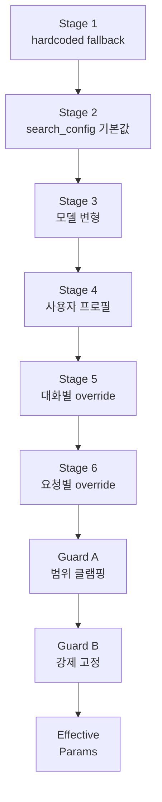
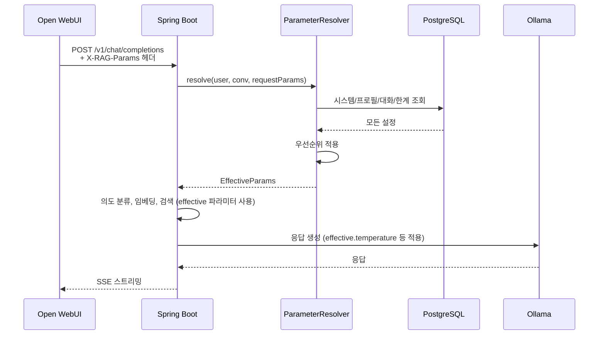

# 사용자 파라미터 튜닝 패널 설계

> 채팅 UI 옆에서 사용자가 직접 RAG/Text-to-SQL 파라미터를 조정.
> Open WebUI 포크하여 통합.

관련 문서:
- [01-architecture.md](01-architecture.md)
- [04-rag-search-strategy.md](04-rag-search-strategy.md) — RAG 검색
- [08-text-to-sql.md](08-text-to-sql.md) — Text-to-SQL

---

## 목차

1. [개요 및 결정사항](#1-개요-및-결정사항)
2. [노출 파라미터 13개](#2-노출-파라미터-13개)
3. [UI 설계](#3-ui-설계)
4. [저장 정책 (프로필 + 대화별 override)](#4-저장-정책-프로필--대화별-override)
5. [안전 가드](#5-안전-가드)
6. [Open WebUI 통합 방법](#6-open-webui-통합-방법)
7. [DB 스키마](#7-db-스키마)
8. [API 설계](#8-api-설계)
9. [Spring Boot 적용 흐름](#9-spring-boot-적용-흐름)
10. [관리자 설정](#10-관리자-설정)
11. [Phase별 도입 계획](#11-phase별-도입-계획)

---

## 1. 개요 및 결정사항

### 핵심 결정사항

| 항목 | 결정 |
|------|------|
| UI 통합 방식 | Open WebUI 포크 → 사이드 패널 추가 |
| 노출 모드 | 단일 (모든 사용자 동일) |
| 노출 파라미터 | 13개 (일부는 표시만, 수정 불가) |
| 저장 정책 | **통합 7단계 체인** — hardcoded < search_config < 모델변형 < 사용자 프로필 < 대화별 < 요청별 + (Guard A 클램핑 / Guard B 강제 고정). 04·08 문서의 파라미터도 이 체인을 따른다. |
| 안전 가드 | 자동 검증 + 관리자 한계 + 초기화 |
| 툴팁 | 각 파라미터마다 설명 표시 |
| **사이드 패널 디폴트 (UX 결정)** | **첫 사용자엔 접힘**. 사용자가 명시적으로 우측 🎛 클릭 시 펼침. preference 저장. [user-journeys.md S1 #11](../docs/ux/user-journeys.md) |
| **변경 적용 시점 (UX 결정)** | **다음 메시지부터** + 우측 상단 toast: `"다음 메시지부터 적용됩니다. [이 답변 다시 받기]"`. 사용자가 즉시 재생성도 선택 가능. [user-journeys.md S9 M9-6/M9-7](../docs/ux/user-journeys.md) |
| **프로필 vs 대화별 디폴트 (UX 결정)** | 디폴트 = `📋 대화별만` (안전). 명시 액션으로 `💾 프로필 저장` 선택. [user-journeys.md S9 M9-8](../docs/ux/user-journeys.md) |

---

## 2. 노출 파라미터 13개

### 2-1. 검색 파라미터 (수정 가능)

#### Top-K
```
[표시 이름] 검색 결과 수
[툴팁] 
   "질문과 관련된 자료를 몇 개 가져올지 정합니다.
    적게 = 빠르고 정확, 많이 = 풍부한 정보"
[값 범위] 1 ~ 20
[기본값] 5
[입력 방식] 슬라이더 + 숫자 입력
```

#### Similarity Threshold
```
[표시 이름] 유사도 임계값
[툴팁]
   "이 정도 비슷한 자료만 사용합니다.
    높을수록 정확한 자료만 (1.0 = 완벽 일치)
    낮을수록 폭넓게 검색 (0.5 = 약한 관련도)"
[값 범위] 0.0 ~ 1.0 (0.05 단위)
[기본값] 0.65
[입력 방식] 슬라이더 (0~1)
```

### 2-2. LLM 생성 파라미터 (수정 가능)

#### Temperature
```
[표시 이름] 창의성 (Temperature)
[툴팁]
   "AI 답변의 창의성을 조절합니다.
    낮으면 일관되고 사실 위주, 높으면 다양하고 창의적.
    사실 기반 답변엔 낮게, 글쓰기엔 높게 추천."
[값 범위] 0.0 ~ 2.0 (0.1 단위)
[기본값] 0.7
[입력 방식] 슬라이더
```

#### Top P
```
[표시 이름] 응답 다양성 (Top P)
[툴팁]
   "단어 선택 시 상위 확률의 후보군 크기.
    낮으면 안정적, 높으면 다양한 표현.
    Temperature와 함께 조정하면 효과 큼."
[값 범위] 0.0 ~ 1.0 (0.05 단위)
[기본값] 0.9
[입력 방식] 슬라이더
```

#### Max Tokens
```
[표시 이름] 응답 최대 길이
[툴팁]
   "AI 답변의 최대 길이 (토큰 단위, 약 1단어=1.5토큰).
    짧으면 빠르게, 길면 자세한 답변 가능."
[값 범위] 100 ~ 4096
[기본값] 2000
[입력 방식] 슬라이더 + 숫자 입력
```

### 2-3. Text-to-SQL 파라미터 (일부 고정)

#### SQL Temperature (🔒 수정 비활성화)
```
[표시 이름] SQL 창의성
[툴팁]
   "SQL 생성 시 일관성을 위해 고정값 사용 중.
    정확한 SQL 생성을 위해 변경 불가."
[고정값] 0.1
[상태] 비활성화 (회색 표시, 잠금 아이콘 🔒)
[설명 표시] "관리자 정책으로 고정"
```

#### Few-Shot Examples (🔒 수정 비활성화)
```
[표시 이름] SQL 예시 개수
[툴팁]
   "SQL 생성 시 참고할 예시 개수.
    최적화된 값으로 고정되어 있습니다."
[고정값] 5
[상태] 비활성화 (잠금 아이콘 🔒)
```

#### Query Timeout
```
[표시 이름] SQL 실행 제한 시간 (초)
[툴팁]
   "SQL 쿼리가 이 시간 안에 끝나야 합니다.
    복잡한 집계 쿼리에 시간 필요하면 늘리세요.
    너무 늘리면 DB 부하 증가."
[값 범위] 5 ~ 60
[기본값] 10
[입력 방식] 슬라이더 + 숫자
```

#### Max Result Rows
```
[표시 이름] SQL 결과 최대 행 수
[툴팁]
   "SQL 쿼리 결과 최대 몇 행까지 가져올지.
    너무 많으면 응답이 길어지고 비용 증가."
[값 범위] 10 ~ 10000
[기본값] 1000
[입력 방식] 숫자 입력 (10 / 100 / 1000 / 5000 / 10000 프리셋)
```

### 2-4. 의도 분류 / 혼합 파라미터 (수정 가능)

#### 강제 경로 (Force Path)
```
[표시 이름] 검색 방식
[툴팁]
   "AI가 자동으로 적절한 방식을 선택하거나
    원하는 방식을 직접 지정할 수 있습니다.
    - 자동: AI 판단 (권장)
    - 문서 검색: 계약서/매뉴얼에서 답 찾기
    - 데이터 조회: 수치/집계 데이터
    - 종합: 두 가지 모두 사용"
[옵션] AUTO | FORCE_RAG | FORCE_SQL | FORCE_HYBRID
[기본값] AUTO
[입력 방식] 라디오 버튼 (4개)
```

#### Hybrid Synthesis Style
```
[표시 이름] 종합 스타일
[툴팁]
   "혼합 검색 시 결과를 어떻게 섞을지.
    - 균형: 수치와 문서 동등하게 (권장)
    - 수치 우선: 숫자 강조 답변
    - 문서 우선: 설명 위주 답변"
[옵션] BALANCED | SQL_FIRST | RAG_FIRST
[기본값] BALANCED
[입력 방식] 라디오 버튼 (3개)
[비활성화 조건] 강제 경로가 FORCE_HYBRID 또는 AUTO일 때만 활성
```

### 2-5. 대화 관련 파라미터

#### Max History Turns
```
[표시 이름] 대화 기억 길이
[툴팁]
   "이전 대화를 몇 턴까지 기억할지.
    1턴 = 사용자 질문 + AI 답변.
    길게 = 긴 대화 맥락 유지, 응답 느림.
    짧게 = 빠른 응답, 맥락 손실."
[값 범위] 1 ~ 50
[기본값] 10
[입력 방식] 슬라이더 + 숫자
```

#### Max Context Tokens (🔒 수정 비활성화)
```
[표시 이름] 검색 결과 토큰 한도
[툴팁]
   "검색된 자료(청크)의 총 토큰 한도입니다.
    Top-K × 청크 크기가 이 값을 넘으면 채우다 자동 중단합니다.
    대화 이력·시스템 프롬프트·응답 공간은 별개 예산이며 따로 관리됩니다."
[고정값] 5000   ← broad 변형(K=10×500) 안전 커버
[상태] 비활성화 (잠금 아이콘 🔒)
[설명 표시] "시스템 자동 관리 — 04/05 문서 정의 따름"
```

---

## 3. UI 설계

### 전체 레이아웃

```
┌──────────────────────────────────────────────────────────────────┐
│ Open WebUI 헤더                                       [⚙️ 설정] │
├────────────┬─────────────────────────────────┬───────────────────┤
│ 대화 목록   │  💬 채팅 영역                    │ 🎛️ 파라미터 패널  │
│            │                                  │                  │
│ - 새 대화   │  사용자: A 상품 보증?            │ 🔄 [초기화]       │
│ - 대화 1   │                                  │ 💾 [저장]         │
│ - 대화 2   │  AI: 보증 기간은 2년입니다...     │                  │
│ ...        │                                  │ [검색 설정]      │
│            │                                  │ ─────────────    │
│            │                                  │ 결과 수      [5] │
│            │                                  │ ━━●━━━━━━ (1-20)│
│            │                                  │                  │
│            │                                  │ 유사도 [0.65]    │
│            │                                  │ ━━━━●━━━━ (0-1) │
│            │                                  │                  │
│            │                                  │ [응답 설정]      │
│            │                                  │ ─────────────    │
│            │                                  │ 창의성  [0.7]    │
│            │                                  │ ━━━━●━━━━        │
│            │                                  │                  │
│            │                                  │ 응답 다양성[0.9] │
│            │                                  │ ━━━━━━●━━        │
│            │                                  │                  │
│            │                                  │ 응답 길이[2000]  │
│            │                                  │ ━━━●━━━━━━       │
│            │                                  │                  │
│            │                                  │ [SQL 설정]       │
│            │                                  │ ─────────────    │
│            │                                  │ 🔒 SQL 창의성 0.1│
│            │                                  │ 🔒 SQL 예시  5개 │
│            │                                  │                  │
│            │                                  │ SQL 시간제한[10s]│
│            │                                  │ ━━●━━━━━━━       │
│            │                                  │                  │
│            │                                  │ SQL 결과수[1000] │
│            │                                  │ [100|1000|5000]  │
│            │                                  │                  │
│            │                                  │ [검색 방식]      │
│            │                                  │ ─────────────    │
│            │                                  │ ⦿ 자동           │
│            │                                  │ ○ 문서 검색       │
│            │                                  │ ○ 데이터 조회     │
│            │                                  │ ○ 종합            │
│            │                                  │                  │
│            │                                  │ [종합 스타일]    │
│            │                                  │ ─────────────    │
│            │                                  │ ⦿ 균형            │
│            │                                  │ ○ 수치 우선        │
│            │                                  │ ○ 문서 우선        │
│            │                                  │                  │
│            │                                  │ [대화 설정]      │
│            │                                  │ ─────────────    │
│            │                                  │ 대화 기억[10턴]  │
│            │                                  │ ━━━●━━━━━━       │
│            │                                  │                  │
│            │                                  │ 🔒 컨텍스트 5000 │
│            │                                  │                  │
│            │                                  │ [💾 프로필 저장]  │
│            │                                  │ [📋 대화별만]    │
│  [입력창]                              [전송] │                  │
└────────────┴─────────────────────────────────┴───────────────────┘
```

### 패널 토글

```
[기본 상태] 패널 펼침 (데스크톱 width 1400px+)
[좁은 화면] 패널 접힘, 우측 상단 🎛️ 버튼으로 토글
[모바일] 모달로 표시
```

### 인터랙션 상세

```
[변경 시 즉시 반영]
- 파라미터 변경 → 다음 채팅 메시지부터 적용
- 현재 화면 메시지엔 영향 없음
- 변경 후 "다음 메시지부터 적용됨" 안내 (Toast)

[저장 옵션]
1. 💾 프로필 저장 — 모든 대화에 적용 (사용자 기본값 변경)
2. 📋 대화별만 — 현재 대화에만 적용 (떠나면 사라짐)

[초기화 버튼]
- 사용자 프로필 → 시스템 기본값으로 복원
- 확인 다이얼로그: "정말 초기화하시겠습니까?"

[잠금 파라미터]
🔒 아이콘 + 회색 처리
호버 시 툴팁: "관리자 정책으로 고정된 값입니다"
```

### 모달 / 알림

```
[저장 성공]
✅ 프로필이 저장되었습니다.

[검증 실패]
⚠️ Top-K는 1~20 사이여야 합니다.

[관리자 한계 도달]
🛑 이 파라미터는 5~15 사이로 제한되어 있습니다.
   (관리자가 설정)
```

---

## 4. 저장 정책 — 통합 7단계 우선순위 (single source of truth)

이 시스템 전체에서 파라미터 값을 결정하는 단일 권위 체인.
04-rag-search-strategy.md, 08-text-to-sql.md의 검색·SQL 파라미터도 이 체인을 따른다.

### 적용 순서 (위→아래, 나중이 이김)

```
[Stage 1] 코드 hardcoded fallback             ← 마지막 안전망
[Stage 2] search_config 테이블 기본값          ← 전체 공통 출발점
[Stage 3] 모델 변형 (precise/balanced/broad)   ← Open WebUI 드롭다운 선택
[Stage 4] 사용자 프로필 (user_param_profiles) ← 패널에서 '💾 프로필 저장' 한 값
[Stage 5] 대화별 override                     ← 패널에서 '📋 대화별만'
[Stage 6] 요청별 override (body rag_params)    ← 디버깅 / CLI / Phase 1+ A/B
```

### 관리자 가드 — 두 종류로 분리

```
[Guard A] 범위 클램핑 (soft, silent)
  - admin_param_limits.min_value / max_value
  - Stage 1~6 결과를 min/max로 잘라낸다
  - 사용자 입력의 자유는 보존, 안전 한계만 보장
  - 예: top_k 1~15 클램핑, 0.0~1.0 클램핑

[Guard B] 강제 고정 (hard, override)
  - admin_param_limits.is_locked = true + fixed_value
  - Stage 1~6 결과를 무시하고 fixed_value 덮어쓴다
  - 가장 마지막 단계 (절대 override 불가)
  - 예: sql_temperature 0.1 고정, max_context_tokens 5000 고정
```

### 추상→구체 원칙

```
모델 변형 (Stage 3) ← 추상 (드롭다운 1회 클릭)
사용자 프로필 (Stage 4) ← 안정적 선호 (저장)
대화별 (Stage 5) ← 이 대화만
요청별 (Stage 6) ← 이 한 요청만 ← 구체

→ 사용자가 더 구체적인 의도를 표현할수록 우선
→ 관리자 가드는 그 위 / 또는 그 결과를 잘라내는 별도 layer
```

### 데이터 흐름



### 시나리오 예시

```
[시나리오 1: 처음 사용자]
1. 가입 후 첫 채팅
2. 파라미터 패널 → 시스템 기본값 표시
3. 사용 중 Top-K=5 → 7로 변경
4. "💾 프로필 저장" 클릭
5. 이후 모든 새 대화에서 Top-K=7

[시나리오 2: 특정 대화만 다르게]
1. 평소엔 Top-K=7 (프로필)
2. 특정 대화에서 Temperature 0.7 → 0.3 변경
3. "📋 대화별만" 클릭
4. 이 대화에서만 T=0.3
5. 다른 대화 (현재 또는 신규)는 프로필 값 유지

[시나리오 3: 초기화]
1. 프로필 초기화 클릭
2. 시스템 기본값으로 복원
3. 새 대화부터 적용
4. 기존 대화의 override는 그대로 유지
```

---

## 5. 안전 가드

### 5-1. 자동 검증

```java
public class ParameterValidator {
    
    private static final Map<String, ParamSpec> SPECS = Map.of(
        "top_k",                new ParamSpec(1, 20, Integer.class),
        "similarity_threshold", new ParamSpec(0.0, 1.0, Double.class),
        "temperature",          new ParamSpec(0.0, 2.0, Double.class),
        "top_p",                new ParamSpec(0.0, 1.0, Double.class),
        "max_tokens",           new ParamSpec(100, 4096, Integer.class),
        "query_timeout_sec",    new ParamSpec(5, 60, Integer.class),
        "max_result_rows",      new ParamSpec(10, 10000, Integer.class),
        "max_history_turns",    new ParamSpec(1, 50, Integer.class)
    );
    
    public ValidationResult validate(String key, Object value) {
        ParamSpec spec = SPECS.get(key);
        if (spec == null) {
            return ValidationResult.deny("알 수 없는 파라미터");
        }
        
        if (!spec.allowedType().isInstance(value)) {
            return ValidationResult.deny("잘못된 타입");
        }
        
        double num = ((Number) value).doubleValue();
        if (num < spec.min() || num > spec.max()) {
            return ValidationResult.deny(
                String.format("%s는 %s ~ %s 사이여야 합니다", 
                    key, spec.min(), spec.max())
            );
        }
        
        return ValidationResult.ok();
    }
}
```

### 5-2. 관리자 한계 설정

관리자가 사용자 파라미터 범위 제한 가능.

```sql
-- admin_param_limits 테이블
CREATE TABLE admin_param_limits (
    id              SERIAL PRIMARY KEY,
    param_key       VARCHAR(100) NOT NULL UNIQUE,
    min_value       JSONB,                     -- {"value": 0.5}
    max_value       JSONB,                     -- {"value": 0.9}
    fixed_value     JSONB,                     -- 강제 고정값
    is_locked       BOOLEAN DEFAULT false,     -- 수정 비활성화 여부
    locked_reason   TEXT,                      -- 잠금 사유 (사용자 표시)
    updated_by      VARCHAR(200),
    updated_at      TIMESTAMP DEFAULT NOW()
);

-- 초기 데이터
INSERT INTO admin_param_limits (param_key, fixed_value, is_locked, locked_reason) VALUES
('sql_temperature', '0.1', true, '정확한 SQL 생성을 위해 고정'),
('sql_few_shot_examples', '5', true, '최적화된 값으로 고정'),
('max_context_tokens', '5000', true, '시스템 자동 관리');

-- 범위 제한 예시
INSERT INTO admin_param_limits (param_key, min_value, max_value) VALUES
('top_k', '{"value": 1}', '{"value": 15}'),  -- 1~15만 허용 (1~20 중)
('temperature', '{"value": 0.0}', '{"value": 1.5}');  -- 1.5까지만
```

### 5-3. 설정 초기화

```
[프로필 초기화]
사용자 파라미터 프로필 → 시스템 기본값으로
대화별 override는 보존

[전체 초기화]
사용자 프로필 + 모든 대화 override 삭제
시스템 기본값으로 완전 복원

API:
DELETE /api/v1/user/param-profile        ← 프로필만 초기화
DELETE /api/v1/user/param-profile/all    ← 전체 초기화
```

### 5-4. 충돌 감지 (Phase 1+)

```
[감지 케이스]
- Temperature 0 + Top P 0.1 → 양쪽 다 매우 제한적
- Force Path = SQL + Synthesis Style 변경 → SQL만이므로 Style 무의미
- Top-K = 1 + Threshold = 0.9 → 결과 없을 가능성 큼

[대응]
파라미터 패널에 노란 경고 표시:
"⚠️ 현재 설정으로 응답이 매우 제한적일 수 있습니다."
```

---

## 6. Open WebUI 통합 방법

### 통합 옵션 비교

```
[옵션 A] Open WebUI 포크 + 직접 수정 ← 채택
- React 컴포넌트 추가
- 사이드 패널 UI 직접 구현
- 장점: 깊은 통합, 일관된 UX
- 단점: upstream 업데이트 추적 부담

[옵션 B] Open WebUI Plugin/Extension
- 공식 플러그인 시스템 활용
- Open WebUI 플러그인 시스템 현재 제한적
- 단점: 기능 부족

[옵션 C] iframe으로 별도 UI 임베드
- Open WebUI 화면 옆에 우리 패널
- 통신: PostMessage API
- 장점: Open WebUI 변경 최소화
- 단점: UX 분절감

→ 옵션 A 채택 (Phase 0)
```

### 포크 전략

```
[리포지토리]
GitHub: company-rag/open-webui-fork
- Open WebUI upstream을 fork
- 우리 변경사항을 별도 브랜치 our/main
- 보안 패치는 즉시, 일반 업데이트는 분기 1회

[디렉토리 구조]
open-webui-fork/
├── src/                       ← Open WebUI 원본
│   ├── lib/components/
│   │   ├── chat/              ← 기존 채팅 컴포넌트
│   │   └── custom/            ← 우리 추가 컴포넌트
│   │       ├── ParameterPanel.svelte
│   │       ├── ParameterSlider.svelte
│   │       └── ParameterRadio.svelte
│   └── routes/
└── docker/
    └── Dockerfile             ← 우리 빌드
```

### 포크 유지보수 정책 (옵션 B 채택)

**원칙**: 분기별 정기 동기화 + 보안 패치 즉시.

```
[정기 동기화 - 분기 1회]
- 주기: 매 분기 시작 (3월/6월/9월/12월)
- 작업량: 1~3일 (시니어 1명)
- 절차:
  1. upstream/main의 변경사항 분석
  2. 우리 변경과의 충돌 검토
  3. 테스트 환경에서 머지 + 검증
  4. our/main 반영
  5. Docker 이미지 재빌드 + ECR 푸시
  6. 다음 배포 사이클에 포함

[보안 패치 - 즉시]
- 트리거: Open WebUI 보안 advisory
- SLA: 발견 후 1주 내 적용
- 절차:
  1. CVE 또는 보안 issue 감지 (Watch 등록)
  2. 패치 커밋만 cherry-pick
  3. 우리 변경과 충돌 즉시 해결
  4. 긴급 빌드 + 배포 (Jenkins 핫픽스)
  5. 고객사별 점검 시간 협의 (필요 시)

[메이저 업데이트 (v0.x → v1, v1 → v2)]
- 별도 Sprint 할당 (1~2주)
- 사전 테스트 환경 구축
- 마이그레이션 가이드 작성
- 점진적 롤아웃 (테스트 → 베타 고객 → 전체)
- 6개월 lag 허용 (안정성 우선)
```

### 담당 및 책임

```
[정기 동기화]
- 담당: 백엔드 시니어 1명 (지정)
- 백업: DevOps 1명
- 분기 1회, 평균 1~3일

[보안 패치]
- 1차 모니터링: DevOps (GitHub Watch + 자동 알람)
- 패치 적용: 백엔드 시니어
- 24/7 대기 의무 없음 (1주 SLA)

[메이저 업데이트]
- 전체 팀 협업
- PM이 일정 조율
- Sprint 단위 작업
```

### 브랜치 전략

```
upstream/main      ← Open WebUI 공식 main (read-only)
upstream/v*        ← 공식 릴리즈 태그 (참고)
our/main           ← 운영 브랜치 (배포 기준)
our/feature/*      ← 우리 기능 개발
our/sync/YYYY-Q*   ← 분기 동기화 작업 브랜치
our/security/CVE-* ← 보안 패치 브랜치
```

### 충돌 해결 우선순위

```
[1] 보안 패치 vs 우리 변경
    → 보안 패치 우선, 우리 코드 수정해서 적용

[2] upstream 기능 vs 우리 사이드 패널
    → 우리 사이드 패널 우선 유지
    → upstream이 비슷한 기능 추가하면 비교 후 결정

[3] upstream 리팩토링 vs 우리 의존 코드
    → 새 구조에 맞춰 우리 코드 수정
    → 너무 큰 변경이면 다음 분기로 연기

[4] 충돌 해결 불가 시
    → 백엔드 시니어 + DevOps + PM 결정
    → 옵션: (a) 우리 변경 폐기, (b) upstream 변경 폐기,
            (c) 둘 다 유지 (커스텀 패치)
```

### 테스트 매트릭스 (매 동기화 후 필수)

```
☑ 로그인 / 인증
☑ 채팅 기본 동작 (SSE 스트리밍 포함)
☑ 사이드 패널 UI (13개 파라미터)
☑ 파라미터 저장/적용
☑ 모델 변형 선택
☑ 첨부 파일 (Sprint 8 이후)
☑ 이미지 첨부 (Sprint 8 이후)
☑ Admin Web UI 연동 (Sprint 9 이후)
☑ X-User-Email 헤더 전달 검증
```

### 메이저 업데이트 트리거

```
[즉시 검토]
- 보안 critical 패치
- 우리 의존 기능의 breaking change

[분기 검토]
- 사용자 요청 기능
- 성능 개선
- UX 개선

[lag 허용 (6개월~)]
- 메이저 버전 (v1 → v2)
- 대규모 리팩토링
- 우리에게 영향 없는 새 기능
```

### Phase별 도입

```
[Phase 0 — Sprint 5에 도입]
- 포크 셋업
- 사이드 패널 추가
- 첫 동기화 (포크 시점 upstream)

[Phase 0 — Sprint 9 출시 이후]
- 첫 분기 동기화 발생 (출시 후 ~3개월)
- 보안 모니터링 시작 (Watch 등록)

[Phase 1+]
- 분기 동기화 정착
- 자동화 검토 (CI에서 충돌 미리 감지)

[Phase 2+]
- Open WebUI 의존도 재검토
- 필요 시 자체 UI 마이그레이션
```

### 변경 범위 최소화 원칙

```
[하지 않을 것]
✗ 기존 Open WebUI 핵심 로직 수정
✗ 인증/세션 시스템 변경
✗ 대화 저장 로직 변경

[할 것]
✓ 채팅 화면에 사이드 패널 추가 (Svelte 프론트엔드)
✓ 사용자 프로필 페이지에 "RAG 설정" 탭 추가
✓ **백엔드 프록시에 사용자 식별 헤더 주입 미들웨어 추가** (Python/FastAPI)
✓ 프론트엔드는 `rag_params` body 필드만 추가 (헤더 직접 추가 금지)
```

### 보안 원칙 — 사용자 식별은 백엔드에서만 주입

```
[금지 — 브라우저(클라이언트)에서 X-User-* 헤더 추가]
이유: 사용자가 임의로 위변조 가능 → 신원 위장 / 권한 상승 취약점

[채택 — Open WebUI 백엔드(서버)에서 헤더 주입]
- Open WebUI 백엔드가 세션으로 사용자를 이미 인증함
- 인증된 신원을 Spring Boot로 전달할 때만 헤더 사용
- Spring Boot는 발신 IP가 k3s 내부인지 확인 후 신뢰
```

> 관련 결정: [07-auth-security.md 섹션 8](07-auth-security.md#8-rate-limiting)
> Spring Boot는 X-User-* 헤더를 **내부 IP에서만** 신뢰함.

### 흐름

```
브라우저 (불신뢰)
   │ 1. POST /api/v1/chat/completions
   │    body: { model, messages, rag_params: {...} }
   │    (사용자 식별 헤더 없음 — 세션 쿠키만)
   ▼
Open WebUI 백엔드 (k3s Pod, 내부 IP)
   │ 2. 세션 쿠키로 사용자 인증
   │ 3. 사용자 정보를 헤더로 주입:
   │    X-User-Email, X-User-Id, X-User-Role
   │ 4. Spring Boot API Key Bearer 추가
   ▼
Spring Boot (k3s Pod, 내부 IP)
   │ 5. 발신 IP 검증 (k3s VPC 대역?)
   │ 6. X-User-* 헤더 신뢰 → 사용자 식별
   │ 7. rag_params body 필드 추출 → 적용
   ▼
RAG 처리
```

### Open WebUI 백엔드 미들웨어 (Python/FastAPI)

```python
# open-webui-fork/backend/apps/openai/main.py (또는 신규 미들웨어)
from fastapi import Request, HTTPException

UPSTREAM_BASE = "http://rag-backend.rag.svc.cluster.local:8080"
UPSTREAM_API_KEY = os.environ["RAG_BACKEND_API_KEY"]  # sk-rag-...

@app.post("/v1/chat/completions")
async def proxy_chat_completions(request: Request, user=Depends(get_current_user)):
    """
    Open WebUI가 인증한 사용자 정보를 헤더로 주입하여
    Spring Boot RAG 백엔드로 프록시.
    클라이언트가 보낸 X-User-* 헤더는 무시한다.
    """
    body = await request.body()

    # 클라이언트가 보낸 X-User-* 헤더는 신뢰하지 않음 → 새로 구성
    upstream_headers = {
        "Authorization": f"Bearer {UPSTREAM_API_KEY}",
        "Content-Type": "application/json",
        "X-User-Email": user.email,        # 세션 인증된 신원
        "X-User-Id":    str(user.id),
        "X-User-Role":  user.role,         # 'admin' | 'user'
    }

    # body 안의 rag_params는 그대로 전달 (Spring Boot가 검증)
    async with httpx.AsyncClient(timeout=60) as client:
        upstream_resp = await client.post(
            f"{UPSTREAM_BASE}/v1/chat/completions",
            content=body,
            headers=upstream_headers,
        )

    # SSE 스트리밍 그대로 반환
    return StreamingResponse(
        upstream_resp.aiter_bytes(),
        media_type=upstream_resp.headers.get("content-type"),
    )
```

### 프론트엔드(Svelte) — 헤더가 아닌 body로 파라미터 전달

```typescript
// 사이드 패널에서 변경한 파라미터는 body의 rag_params 필드로
async function sendChat(messages, ragParams) {
  // 백엔드 프록시(/v1/chat/completions)로만 요청
  // 사용자 식별 헤더는 백엔드가 주입 — 여기서는 절대 추가하지 않는다
  const res = await fetch('/v1/chat/completions', {
    method: 'POST',
    headers: { 'Content-Type': 'application/json' },
    credentials: 'include',   // 세션 쿠키
    body: JSON.stringify({
      model: 'company-rag-balanced',
      messages,
      rag_params: {            // OpenAI API extra body
        top_k: ragParams.topK,
        similarity_threshold: ragParams.similarity,
        temperature: ragParams.temperature,
        top_p: ragParams.topP,
        max_tokens: ragParams.maxTokens,
        force_path: ragParams.forcePath,           // AUTO | FORCE_RAG | FORCE_SQL | FORCE_HYBRID
        hybrid_style: ragParams.hybridStyle,       // BALANCED | SQL_FIRST | RAG_FIRST
        max_history_turns: ragParams.maxHistory,
        query_timeout_sec: ragParams.sqlTimeout,
        max_result_rows: ragParams.sqlMaxRows,
      }
    })
  });
  return res.body;  // SSE 스트림
}
```

### Spring Boot 측 헤더 검증

```java
@Component
public class TrustedHeaderFilter extends OncePerRequestFilter {

    @Value("${trusted.internal-cidrs}")
    private List<String> internalCidrs;  // e.g. "10.0.0.0/16"

    @Override
    protected void doFilterInternal(HttpServletRequest req,
                                     HttpServletResponse res,
                                     FilterChain chain) throws IOException, ServletException {
        String clientIp = ClientIpResolver.resolve(req);  // X-Forwarded-For 최우측 신뢰 IP

        boolean fromInternal = internalCidrs.stream()
            .anyMatch(cidr -> CidrUtils.matches(clientIp, cidr));

        if (!fromInternal) {
            // 외부에서 들어온 X-User-* 헤더는 제거 (request wrapper)
            req = new HeaderStrippingRequestWrapper(req, Set.of(
                "X-User-Email", "X-User-Id", "X-User-Role"
            ));
        }
        chain.doFilter(req, res);
    }
}
```

### 트레이드오프

```
[채택한 비용]
- Open WebUI Python 백엔드 fork 깊이 증가
  → Svelte 프론트엔드만 수정하는 것보다 upstream 동기화 부담 큼
- 프록시 한 단계 추가 → 약 5~20ms latency
  → SSE 스트리밍 응답에선 무시 가능 (Time-to-First-Token이 LLM에 비해 지배적)

[얻는 것]
- 사용자가 헤더 위변조해도 무시됨 (방어선이 Spring Boot에 있음)
- Open WebUI 인증 = 신원의 단일 출처
- audit_log / Rate Limit / 파라미터 프로필이 실제 사용자 기준으로 작동
```

---

## 7. DB 스키마

### 7-1. 사용자 파라미터 프로필

```sql
CREATE TABLE user_param_profiles (
    id              UUID PRIMARY KEY DEFAULT gen_random_uuid(),
    user_email      VARCHAR(200) NOT NULL UNIQUE,
    
    -- 파라미터 (JSON으로 묶음)
    params          JSONB NOT NULL,
    
    created_at      TIMESTAMP DEFAULT NOW(),
    updated_at      TIMESTAMP DEFAULT NOW()
);

CREATE INDEX idx_user_profiles_email ON user_param_profiles (user_email);

-- 데이터 예시
INSERT INTO user_param_profiles (user_email, params) VALUES (
    'user@customer.com',
    '{
      "top_k": 7,
      "similarity_threshold": 0.7,
      "temperature": 0.6,
      "top_p": 0.9,
      "max_tokens": 2500,
      "force_path": "AUTO",
      "hybrid_style": "BALANCED",
      "max_history_turns": 15,
      "query_timeout_sec": 10,
      "max_result_rows": 1000
    }'::jsonb
);
```

### 7-2. 대화별 Override

```sql
CREATE TABLE conversation_param_overrides (
    id                  UUID PRIMARY KEY DEFAULT gen_random_uuid(),
    conversation_id     VARCHAR(200) NOT NULL,  -- Open WebUI conv ID
    user_email          VARCHAR(200) NOT NULL,
    
    -- override 파라미터 (프로필과 다른 것만)
    params              JSONB NOT NULL,
    
    created_at          TIMESTAMP DEFAULT NOW(),
    updated_at          TIMESTAMP DEFAULT NOW(),
    
    UNIQUE (conversation_id, user_email)
);

CREATE INDEX idx_conv_overrides_conv ON conversation_param_overrides (conversation_id);

-- 데이터 예시 (Temperature만 override)
INSERT INTO conversation_param_overrides (
    conversation_id, user_email, params
) VALUES (
    'conv-abc123', 'user@customer.com',
    '{"temperature": 0.3}'::jsonb
);
```

### 7-3. 관리자 한계

```sql
CREATE TABLE admin_param_limits (
    id              SERIAL PRIMARY KEY,
    param_key       VARCHAR(100) NOT NULL UNIQUE,
    min_value       JSONB,
    max_value       JSONB,
    fixed_value     JSONB,
    is_locked       BOOLEAN DEFAULT false,
    locked_reason   TEXT,
    updated_by      VARCHAR(200),
    updated_at      TIMESTAMP DEFAULT NOW()
);

-- 초기 데이터
INSERT INTO admin_param_limits (param_key, fixed_value, is_locked, locked_reason) VALUES
('sql_temperature', '0.1', true, '정확한 SQL 생성을 위해 고정'),
('sql_few_shot_examples', '5', true, '최적화된 값으로 고정'),
('max_context_tokens', '5000', true, '시스템 자동 관리');
```

---

## 8. API 설계

### 8-1. 사용자 API

```http
[프로필 조회]
GET /api/v1/user/param-profile
Authorization: Bearer {user-api-key}

response: {
  "params": {
    "top_k": 7,
    "similarity_threshold": 0.7,
    ...
  },
  "defaults": {
    "top_k": 5,
    ...
  },
  "limits": {
    "sql_temperature": {"fixed": 0.1, "locked": true},
    "top_k": {"min": 1, "max": 15}
  }
}

[프로필 저장]
PUT /api/v1/user/param-profile
body: {
  "params": {
    "top_k": 7,
    "temperature": 0.6,
    ...
  }
}

response: {"saved": true, "validated_params": {...}}

[프로필 초기화]
DELETE /api/v1/user/param-profile

[대화별 Override 저장]
PUT /api/v1/user/conversations/{conv_id}/param-override
body: { "params": {...} }

[대화별 Override 삭제]
DELETE /api/v1/user/conversations/{conv_id}/param-override

[현재 적용 중인 파라미터 조회 (디버깅용)]
GET /api/v1/user/conversations/{conv_id}/effective-params
response: {
  "effective": {...},
  "source": {
    "top_k": "user_profile",
    "temperature": "conversation_override",
    "sql_temperature": "admin_locked"
  }
}
```

### 8-2. 관리자 API

```http
[한계 조회]
GET /api/v1/admin/param-limits
Authorization: Bearer {admin-api-key with api:config}

[한계 변경]
PUT /api/v1/admin/param-limits/{param_key}
body: {
  "min_value": 1,
  "max_value": 15,
  "is_locked": false
}

[강제 고정]
PUT /api/v1/admin/param-limits/{param_key}/lock
body: {
  "fixed_value": 0.1,
  "locked_reason": "정확한 SQL 생성을 위해 고정"
}

[잠금 해제]
DELETE /api/v1/admin/param-limits/{param_key}/lock
```

---

## 9. Spring Boot 적용 흐름

### ParameterResolver 컴포넌트

> 섹션 4의 7단계 체인을 그대로 구현. Guard A(클램핑)와 Guard B(강제 고정)를 분리한다.

```java
@Service
public class ParameterResolver {

    @Autowired private SearchConfigService systemConfig;       // Stage 2
    @Autowired private ModelVariantService modelVariants;      // Stage 3
    @Autowired private UserParamRepository userRepo;           // Stage 4
    @Autowired private ConversationOverrideRepository convRepo;// Stage 5
    @Autowired private AdminLimitsRepository limitsRepo;       // Guard A + B

    /**
     * 통합 우선순위 체인: hardcoded < search_config < model_variant
     *                  < user_profile < conversation < request_body
     *                  + Guard A (clamp) + Guard B (locked override)
     */
    public EffectiveParams resolve(
        String userEmail,
        String conversationId,
        String modelName,                            // 'company-rag-precise' 등
        Map<String, Object> requestParams            // body의 rag_params 필드
    ) {
        Map<String, Object> v   = new HashMap<>();
        Map<String, String> src = new HashMap<>();

        // Stage 1 — hardcoded fallback
        HardcodedDefaults.apply(v);
        v.forEach((k, _x) -> src.put(k, "hardcoded"));

        // Stage 2 — search_config 기본값
        systemConfig.getAllParams().forEach((k, val) -> {
            v.put(k, val); src.put(k, "search_config");
        });

        // Stage 3 — 모델 변형 (precise / balanced / broad)
        modelVariants.findByName(modelName).ifPresent(variant ->
            variant.getOverrides().forEach((k, val) -> {
                v.put(k, val); src.put(k, "model_variant");
            })
        );

        // Stage 4 — 사용자 프로필
        userRepo.findByEmail(userEmail).ifPresent(p ->
            p.getParams().forEach((k, val) -> {
                v.put(k, val); src.put(k, "user_profile");
            })
        );

        // Stage 5 — 대화별 override
        if (conversationId != null) {
            convRepo.findByConversation(conversationId).ifPresent(o ->
                o.getParams().forEach((k, val) -> {
                    v.put(k, val); src.put(k, "conversation_override");
                })
            );
        }

        // Stage 6 — 요청별 override (body의 rag_params)
        if (requestParams != null) {
            requestParams.forEach((k, val) -> {
                v.put(k, val); src.put(k, "request_override");
            });
        }

        // Guard A — 범위 클램핑 (silent, soft)
        Map<String, AdminLimit> limits = limitsRepo.findAllAsMap();
        for (var e : v.entrySet()) {
            AdminLimit l = limits.get(e.getKey());
            if (l == null || l.isLocked()) continue;          // locked은 Guard B에서
            if (e.getValue() instanceof Number n
                    && l.getMin() != null && l.getMax() != null) {
                double clamped = clamp(n.doubleValue(), l.getMin(), l.getMax());
                if (clamped != n.doubleValue()) {
                    e.setValue(clamped);
                    src.put(e.getKey(), src.get(e.getKey()) + "+admin_clamp");
                }
            }
        }

        // Guard B — 강제 고정 (hard, override all)
        for (var entry : limits.entrySet()) {
            AdminLimit l = entry.getValue();
            if (l.isLocked() && l.getFixedValue() != null) {
                v.put(entry.getKey(), l.getFixedValue());
                src.put(entry.getKey(), "admin_locked");      // 이전 source는 모두 무시
            }
        }

        return new EffectiveParams(v, src);
    }

    private double clamp(double val, double min, double max) {
        return Math.max(min, Math.min(max, val));
    }
}
```

### Stage별 책임 요약

| Stage | 데이터 출처 | 변경 권한자 | 변경 빈도 |
|-------|-----------|-----------|---------|
| 1. hardcoded | Java 상수 | 개발자 (배포) | 거의 없음 |
| 2. search_config | DB 테이블 | 관리자 API | 가끔 |
| 3. model_variants | DB 테이블 | 관리자 API | 가끔 |
| 4. user_profile | user_param_profiles | 사용자 (패널 저장) | 가끔 |
| 5. conversation | conversation_param_overrides | 사용자 (대화별만) | 자주 |
| 6. request body | (저장 안 함) | 사용자/CLI | 매 요청 |
| A. clamp | admin_param_limits | 관리자 | 거의 없음 |
| B. locked | admin_param_limits | 관리자 | 거의 없음 |

### 채팅 처리 흐름



### 캐싱 전략

```
[Redis 캐시]
키: param:{user_email}:{conversation_id}
값: EffectiveParams JSON
TTL: 5분

[캐시 무효화]
- 사용자 프로필 변경 → param:{user}:* 모두 무효화
- 대화 override 변경 → param:{user}:{conv} 무효화
- 관리자 한계 변경 → 모든 param:* 무효화
```

---

## 10. 관리자 설정

### 관리자 화면 (Open WebUI 또는 별도)

```
[관리자 화면 → 파라미터 정책]
┌─────────────────────────────────────────────┐
│  사용자 파라미터 한계 설정                    │
│                                              │
│  Top-K              [1] ~ [15]  □ 잠금       │
│  Similarity         [0.3] ~ [1.0] □ 잠금     │
│  Temperature        [0.0] ~ [1.5] □ 잠금     │
│  Top P              [0.0] ~ [1.0] □ 잠금     │
│  Max Tokens         [100] ~ [4096] □ 잠금    │
│  SQL Temperature    [0.1]         ☑ 잠금     │
│    잠금 사유: [정확한 SQL 생성을 위해 고정 ] │
│  Few-Shot Examples  [5]           ☑ 잠금     │
│  Query Timeout      [5] ~ [60]   □ 잠금      │
│  Max Result Rows    [10] ~ [10000] □ 잠금    │
│  Force Path         □ 잠금                   │
│  Hybrid Style       □ 잠금                   │
│  Max History Turns  [3] ~ [30]   □ 잠금      │
│  Max Context Tokens [5000]       ☑ 잠금      │
│                                              │
│  [저장] [기본값으로 복원]                     │
└─────────────────────────────────────────────┘
```

### 관리자 모니터링

```
[대시보드]
- 사용자별 파라미터 사용 통계
- 가장 많이 변경되는 파라미터
- 평균 Top-K, Temperature 등
- 관리자 한계 도달 빈도

→ 데이터 기반으로 기본값/한계 조정
```

---

## 11. Phase별 도입 계획

### Phase 0 — MVP

```
☑ Open WebUI 포크 셋업
☑ 사이드 패널 UI (Svelte)
☑ 13개 파라미터 노출 (잠금 3개: SQL Temperature, Few-Shot Examples, Max Context Tokens)
☑ 사용자 프로필 저장
☑ 대화별 override
☑ 관리자 한계 설정
☑ 자동 검증
☑ 툴팁 + 초기화
☑ Spring Boot ParameterResolver
☑ Redis 캐시
```

### Phase 1 — 정식 출시

```
☑ 충돌 감지 (Temperature 0 + Top P 0.1 등 경고)
☑ 파라미터 사용 통계 대시보드
☑ 프리셋 기능 ("팩트체크", "브레인스토밍" 등)
☑ A/B 테스트 (사용자별 다른 기본값 실험)
☑ 사용자 피드백 연계 (이 설정에서 좋은 답변 비율)
```

### Phase 2 — 확장

```
☑ AI 추천 (질문 유형 보고 최적 파라미터 제안)
☑ 자연어로 파라미터 변경 ("좀 더 자세하게 답해줘" → max_tokens ↑)
☑ 학습 기반 자동 튜닝
```
