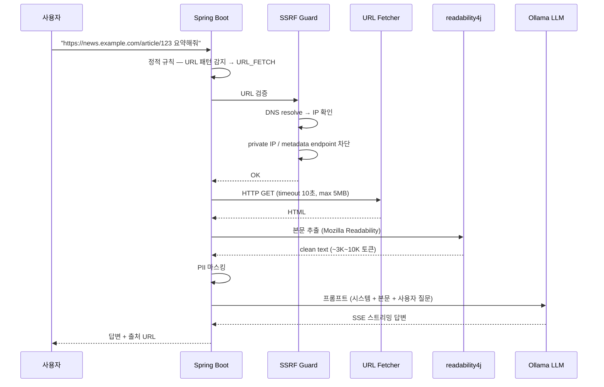
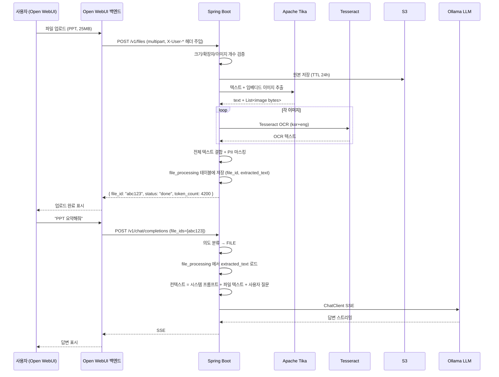
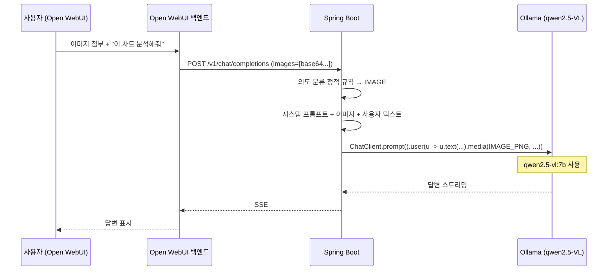

# 멀티모달 · 첨부파일 · URL Fetch 상세 설계

> Phase 0 추가 기능 3종을 한 문서로 묶음.
> 사용자가 채팅에 첨부할 수 있는 입력 형태와 처리 흐름.

관련 문서:
- [01-architecture.md](01-architecture.md) — 전체 아키텍처
- [02-stack-reference.md](02-stack-reference.md) — 스택 레퍼런스
- [04-rag-search-strategy.md](04-rag-search-strategy.md) — 검색 전략 (의도 분류 6경로)
- [07-auth-security.md](07-auth-security.md) — 보안

---

## 목차

1. [개요 및 결정사항](#1-개요-및-결정사항)
2. [의도 분류기 — 6경로](#2-의도-분류기--6경로)
3. [URL Fetch (URL_FETCH 경로)](#3-url-fetch-url_fetch-경로)
4. [첨부파일 (FILE 경로)](#4-첨부파일-file-경로)
5. [멀티모달 — 이미지 (IMAGE 경로)](#5-멀티모달--이미지-image-경로)
6. [HTTP 타임아웃 정책](#6-http-타임아웃-정책)
7. [보안 가드 모음](#7-보안-가드-모음)
8. [Spring AI 멀티모달 통합](#8-spring-ai-멀티모달-통합)
9. [Phase 별 도입 계획](#9-phase-별-도입-계획)

---

## 1. 개요 및 결정사항

### 핵심 결정사항

| 항목 | Phase 0 결정 |
|------|------------|
| URL Fetch | readability4j (Mozilla Readability 포트) + SSRF Guard, 동기 처리 |
| 첨부파일 추출 | Apache Tika (50+ 포맷 통합) |
| 첨부 이미지 OCR | Tesseract (한국어+영어, `kor+eng`) — 첨부파일 안 임베디드 이미지 |
| 첨부 이미지 VLM 캡션 | **Phase 1+** (Phase 0 는 OCR 만) |
| 채팅 이미지 (직접 첨부) | **qwen2.5-VL:7b-instruct-q4_K_M** (옵션 A 듀얼 모델) |
| 비동기 큐 | **사용 안 함** — RabbitMQ 도입 보류, 동기 처리로 통일 |
| HTTP 타임아웃 | **600초** (ALB / Nginx / Spring Boot / Open WebUI 통일) |
| 파일 크기 한도 | **30 MB / 파일, 5 파일 / 메시지, 합계 100 MB / 메시지** |
| 파일 안 이미지 한도 | **200개 / 파일** (초과 시 거부) |
| 파일 보존 | S3 lifecycle TTL 24시간 (Ephemeral) — 영구 등록은 Phase 1+ |
| 허용 확장자 | pdf, docx, doc, pptx, ppt, xlsx, xls, txt, md, csv + 이미지 png/jpg/jpeg/webp |
| 의도 분류 | RAG / SQL / HYBRID / URL_FETCH / FILE / IMAGE — 6경로 |
| 웹 검색 | **Phase 0 미도입** (Phase 1+ Tavily/DuckDuckGo) |
| ReAct / HyDE | **Phase 1+ 검토 항목** |
| **응답 후처리 PII 마스킹 (ADR-0008)** | URL_FETCH / FILE / IMAGE 모든 LLM 자연어화 응답에 `PiiMasker.mask()` 일관 적용. SSE 는 완성 후 마스킹. `rag_pii_masked_total{path}` 메트릭 |
| **UX 권위 출처** | [`docs/ux/user-journeys.md`](../docs/ux/user-journeys.md) S5/S6/S7 — URL 카드·파일 메타·이미지 썸네일 동작 명시 |

### 데이터 외부 전송 정책 정합

```
[원칙]
TEAM-OVERVIEW.md:1 "데이터 외부 전송 없음 (사내 보안)"

[Phase 0 도입 기능과의 관계]
- URL Fetch: 사용자가 명시한 URL 만 호출. 회사 데이터는 외부로 안 나감.
              사용자 의도 자체가 외부 URL 분석이므로 동의 절차 불필요.
- 첨부파일:  S3 (고객사 AWS 계정) 내부 처리. 외부 전송 0.
- 멀티모달:  Ollama (고객사 AWS 계정 내 GPU). 외부 API 호출 0.
- 웹 검색:   외부 검색 엔진 호출 → 데이터 외부 전송. Phase 0 보류.
```

---

## 2. 의도 분류기 — 6경로

### 기존 3경로 → 6경로 확장

```
[Phase 0 의도 분류 결정]
사용자 입력을 다음 6개 중 하나로 분류:

  RAG       — 비정형 텍스트 검색 (계약서·매뉴얼 등)
  SQL       — 정량 데이터 (수치·집계·기간)
  HYBRID    — RAG + SQL 병렬 (수치 + 설명)
  URL_FETCH — 메시지 안에 URL 포함 → 본문 분석
  FILE      — 메시지 안에 file_id 포함 → 첨부파일 컨텍스트
  IMAGE     — 메시지 안에 image 포함 → 멀티모달 LLM
```

### 분류 우선순위 (정적 규칙 + LLM)

```
[정적 규칙 — LLM 호출 전 처리]
1. images 필드 비어있지 않음 → IMAGE
2. file_ids 비어있지 않음    → FILE
3. 메시지 안에 http(s):// URL 패턴 1개 이상 → URL_FETCH

[LLM 분류 — 위 3가지 모두 해당 없을 때]
4. RAG / SQL / HYBRID 중 하나 (08-text-to-sql.md 섹션 3 의도 분류기)

[조합 케이스]
- IMAGE + FILE 동시: IMAGE 우선 (VLM 이 이미지 + 텍스트 동시 처리)
- URL + FILE 동시: FILE 우선 (사용자가 첨부 의도가 더 강함)
- 사용자가 09 패널의 force_path 로 명시 시: 그대로 따름
```

### 의도 분류기 코드 흐름

```java
@Service
public class IntentClassifier {

    public QueryIntent classify(ChatRequest req) {
        // Stage 1 — 정적 규칙 (LLM 호출 0, 무료)
        if (!req.getImages().isEmpty())     return QueryIntent.IMAGE;
        if (!req.getFileIds().isEmpty())    return QueryIntent.FILE;
        if (containsUrl(req.lastMessage())) return QueryIntent.URL_FETCH;

        // Stage 2 — LLM 분류 (캐시 활용)
        return classifyByLlm(req.lastMessage());  // RAG / SQL / HYBRID
    }
}
```

### 응답 시간 예상 (경로별)

| 경로 | 평균 | p99 |
|------|------|-----|
| RAG | 1.5~3초 | 8초 |
| SQL | 3~5초 | 15초 |
| HYBRID | 5~8초 | 20초 |
| URL_FETCH | 4~8초 | 30초 (큰 페이지) |
| FILE (텍스트 PDF) | 10~30초 | 120초 (이미지 多) |
| FILE (스캔 PDF) | 60~150초 | 300초 (OCR 부하) |
| IMAGE | 3~5초 | 12초 (VLM 인퍼런스) |

→ 06-error-handling.md 의 Warning 임계값 (p99 > 10초) 은 RAG/SQL/HYBRID/IMAGE 에만 적용.
→ FILE/URL_FETCH 는 별도 SLO (Phase 0 미정).

---

## 3. URL Fetch (URL_FETCH 경로)

### 흐름



### 도구

```
[HTTP fetch]
- Java 표준 HttpClient (Java 17+) — 외부 의존성 없음
- 또는 Spring WebClient (이미 Spring AI 가 사용)

[HTML 본문 추출]
- readability4j (Mozilla Readability 의 Java 포트)
- Maven: net.dankito.readability4j:readability4j:1.0.8
- JSoup 으로 HTML 파싱 → 본문 영역 추출

[보조]
- Apache Tika (HTML 외 일부 미디어 타입도 처리 가능)
```

### SSRF Guard — 필수 보안 가드

```java
@Component
public class SsrfGuard {

    // RFC 1918 + link-local + loopback + AWS metadata
    private static final List<IpRange> DENIED = List.of(
        IpRange.parse("10.0.0.0/8"),
        IpRange.parse("172.16.0.0/12"),
        IpRange.parse("192.168.0.0/16"),
        IpRange.parse("127.0.0.0/8"),
        IpRange.parse("169.254.0.0/16"),     // AWS metadata 포함
        IpRange.parse("fc00::/7"),           // IPv6 ULA
        IpRange.parse("::1/128"),            // IPv6 loopback
        IpRange.parse("fe80::/10")           // IPv6 link-local
    );

    private static final Set<String> ALLOWED_SCHEMES = Set.of("http", "https");

    public ValidationResult validate(String url) {
        URI uri = URI.create(url);

        // 1. Scheme 검증
        if (!ALLOWED_SCHEMES.contains(uri.getScheme())) {
            return ValidationResult.deny("Unsupported scheme: " + uri.getScheme());
        }

        // 2. DNS resolve → 모든 IP 검증 (한 도메인이 여러 IP 가질 수 있음)
        try {
            for (InetAddress addr : InetAddress.getAllByName(uri.getHost())) {
                if (DENIED.stream().anyMatch(r -> r.contains(addr))) {
                    return ValidationResult.deny("Private/internal IP blocked: " + addr);
                }
            }
        } catch (UnknownHostException e) {
            return ValidationResult.deny("DNS resolution failed");
        }

        return ValidationResult.ok();
    }

    /**
     * Redirect follow 시 매 hop 마다 재검증해야 함 (DNS rebinding 방어).
     * HttpClient 의 redirect 자동 follow 끄고 수동으로 처리.
     */
}
```

### 추가 가드

```
[다운로드 한도]
- Content-Length 검사 (응답 헤더) → 5MB 초과 시 거부
- 실제 스트림 읽기 중 5MB 도달 시 abort

[타임아웃]
- Connect timeout: 5초
- Read timeout: 10초
- 전체 처리: 30초 (Spring AsyncContext)

[Content-Type 화이트리스트]
- text/html, application/xhtml+xml, text/plain
- application/pdf (PDF URL 직접 분석 — readability 우회, Tika 사용)
- 그 외 거부 (binary, octet-stream 등)

[Rate limit]
- URL_FETCH 경로는 분당 10건 / 사용자 (남용 방지)
- Redis 카운터로 별도 추적
```

### 응답에 출처 표시

```
LLM 답변:
"이 기사는 ... 라고 보도합니다. 핵심 내용은 ... [1]"

citations:
[
  {
    "type": "url",
    "url": "https://news.example.com/article/123",
    "title": "기사 제목",
    "fetched_at": "2026-05-19T10:30:00Z"
  }
]
```

---

## 4. 첨부파일 (FILE 경로)

### 동기 처리 전제 — RabbitMQ 미사용

```
[결정]
Phase 0 는 비동기 큐 없이 동기 처리.
- POST /v1/files 요청 thread 가 처리 완료까지 점유
- HTTP 타임아웃 600초로 일반 케이스 cover
- 큰 파일(스캔 PDF 100페이지+) 도 600초 안 처리
- RabbitMQ + Worker 도입은 Phase 1+ (트래픽 증가 시점)
```

### 흐름



### Tika 설정 — 텍스트 + 이미지 처리

```java
@Service
public class FileProcessor {

    @Autowired private S3Client s3;
    @Autowired private PiiMasker piiMasker;
    @Autowired private TokenizerService tokenizer;

    public FileProcessingResult process(MultipartFile file) {
        // 1. 검증
        validate(file);  // 크기 30MB, 확장자, 이미지 개수

        // 2. S3 저장 (원본 보존, TTL 24h lifecycle rule)
        String s3Key = "files/" + UUID.randomUUID() + "/" + file.getOriginalFilename();
        s3.putObject(b -> b.bucket(bucket).key(s3Key), RequestBody.fromBytes(file.getBytes()));

        // 3. Tika 추출
        AutoDetectParser parser = new AutoDetectParser();
        BodyContentHandler textHandler = new BodyContentHandler(-1);  // unlimited
        Metadata metadata = new Metadata();

        // 임베디드 이미지 추출 콜백
        ParseContext ctx = new ParseContext();
        ctx.set(Parser.class, parser);
        List<byte[]> embeddedImages = new ArrayList<>();
        ctx.set(EmbeddedDocumentExtractor.class, new EmbeddedImageCollector(embeddedImages));

        try (InputStream in = file.getInputStream()) {
            parser.parse(in, textHandler, metadata, ctx);
        }

        String mainText = textHandler.toString();

        // 4. 이미지 개수 한도 검증
        if (embeddedImages.size() > 200) {
            throw new ValidationException("이미지 개수 200개 초과: " + embeddedImages.size());
        }

        // 5. Tesseract OCR (각 이미지 — 한국어+영어)
        StringBuilder ocrText = new StringBuilder();
        for (byte[] imgBytes : embeddedImages) {
            String ocrResult = tesseract.doOCR(imgBytes, "kor+eng");
            ocrText.append("[이미지 OCR]\n").append(ocrResult).append("\n\n");
        }

        // 6. PII 마스킹 + 토큰 카운트
        String combined = mainText + "\n\n" + ocrText;
        String masked = piiMasker.mask(combined, PiiMaskingLevel.STANDARD);
        int tokens = tokenizer.count(masked, "qwen2.5:14b-instruct-q4_K_M");

        // 7. DB 저장
        FileProcessing entity = new FileProcessing(
            UUID.randomUUID(), s3Key, masked, tokens, file.getOriginalFilename(), Instant.now()
        );
        repo.save(entity);

        return new FileProcessingResult(entity.getId(), tokens);
    }
}
```

### Tesseract 통합

```
[설치 — Docker 이미지]
FROM eclipse-temurin:21-jdk
RUN apt-get update && apt-get install -y \
    tesseract-ocr \
    tesseract-ocr-kor \
    tesseract-ocr-eng \
    && rm -rf /var/lib/apt/lists/*

[Java 라이브러리]
net.sourceforge.tess4j:tess4j:5.x  (Tesseract Java wrapper)

[설정]
Tesseract tesseract = new Tesseract();
tesseract.setDatapath("/usr/share/tesseract-ocr/4.00/tessdata");
tesseract.setLanguage("kor+eng");
tesseract.setPageSegMode(3);   // AUTO
```

### OCR 신뢰도 임계값 + LLM Fallback (N4 결정)

Tesseract 한국어 OCR 정확도 ~90% — **10% 는 실패**. 신뢰도 기반 fallback:

```java
// Tesseract 신뢰도 점수 활용
int confidence = tesseract.getMeanConfidence();  // 0~100
String ocrText = tesseract.doOCR(imgBytes, "kor+eng");

if (confidence < 70) {
    // 답변에 영향 안 주도록 표시
    ocrText = "[이미지 N: OCR 신뢰도 낮음, 해석 불가]";
    metrics.increment("rag_ocr_low_confidence_total");
}
```

**LLM 자연어화 프롬프트에 지시**:
> "[이미지 N: OCR 신뢰도 낮음, 해석 불가] 표시가 있는 이미지는 답변에 인용하지 마세요."

→ 사용자에게 false 정보 노출 방지. 답변 정확도 우선.

### 파일 처리 DB 스키마

```sql
CREATE TABLE file_processing (
    id              UUID PRIMARY KEY DEFAULT gen_random_uuid(),
    user_email      VARCHAR(200) NOT NULL,
    s3_key          VARCHAR(500) NOT NULL,
    original_name   VARCHAR(500) NOT NULL,
    mime_type       VARCHAR(100),
    size_bytes      BIGINT NOT NULL,

    extracted_text  TEXT NOT NULL,                   -- Tika + OCR 결합, PII 마스킹된 텍스트
    token_count     INT NOT NULL,                    -- Ollama tokenize 결과
    tokenizer_model VARCHAR(100) NOT NULL,

    image_count     INT DEFAULT 0,                   -- 임베디드 이미지 개수
    ocr_image_count INT DEFAULT 0,                   -- OCR 수행한 이미지 개수

    status          VARCHAR(20) NOT NULL,            -- 'done' | 'failed'
    error_message   TEXT,

    created_at      TIMESTAMP DEFAULT NOW(),
    expires_at      TIMESTAMP NOT NULL               -- created_at + 24h, S3 lifecycle 과 일치
);

CREATE INDEX idx_file_processing_user ON file_processing (user_email, created_at DESC);
CREATE INDEX idx_file_processing_expires ON file_processing (expires_at);
```

### 파일 lifecycle 관리

```
[S3 lifecycle 규칙]
files/* → 24시간 후 자동 삭제

[DB cron]
매일 새벽 3시: DELETE FROM file_processing WHERE expires_at < NOW();

[사용자 수동 삭제]
DELETE /v1/files/{file_id} → S3 + DB 즉시 삭제
```

### 검증 규칙

```
[크기]
- 단일 파일: ≤ 30 MB
- 메시지 동시 첨부: ≤ 5 files
- 합계: ≤ 100 MB

[확장자 화이트리스트]
pdf, docx, doc, pptx, ppt, xlsx, xls, txt, md, csv

[임베디드 이미지]
- ≤ 200개 / 파일
- 초과 시 거부 (사용자에게 분할 안내)

[Tika 보안]
- SecureContentHandler 사용 (스크립트 비활성화)
- 압축 해제 한도 100MB (압축 폭탄 방어)

[에러 메시지]
"파일이 30MB를 초과합니다 (현재 78MB)."
"파일 안 이미지가 200개를 초과합니다 (현재 340개). 분할 업로드해주세요."
"허용되지 않는 파일 형식입니다: .exe"
```

---

## 5. 멀티모달 — 이미지 (IMAGE 경로)

### 듀얼 모델 운영 (옵션 A)

```
[GPU 메모리 — g5.xlarge VRAM 24GB]
qwen2.5:14b-instruct-q4_K_M     11GB    (텍스트, 기본 모델)
qwen2.5-vl:7b-instruct-q4_K_M    6GB    (이미지, IMAGE 경로 전용)
                                ─────
합계                             17GB / 24GB → 여유 7GB ✅

[Ollama 동시 로드]
- 두 모델 모두 메모리에 사전 로드
- 콜드 스타트 방지 (Spot 부팅 시 AMI 가 두 모델 모두 포함)
```

### 흐름



### Spring AI 통합

```java
@Service
public class ImagePathService {

    private final ChatClient vlmClient;     // qwen2.5-vl:7b 전용
    private final ChatClient textClient;    // qwen2.5:14b 전용

    public Flux<String> processImageQuery(
        String userText, List<byte[]> images
    ) {
        // Spring AI 의 media() 로 이미지 첨부
        ChatClient.PromptUserSpec userSpec = u -> {
            u.text(userText);
            for (byte[] img : images) {
                u.media(MimeType.valueOf("image/png"), new ByteArrayResource(img));
            }
        };

        return vlmClient.prompt()
            .system(SYSTEM_PROMPT_VLM)
            .user(userSpec)
            .stream()
            .content();
    }
}
```

### 모델 라우팅 (Spring AI 설정)

```yaml
# application-prod.yml
spring.ai.ollama:
  base-url: http://ollama-svc.rag.svc.cluster.local:11434

  chat:
    options:
      model: qwen2.5:14b-instruct-q4_K_M   # 기본 (텍스트 / RAG / SQL / HYBRID / FILE / URL_FETCH)

# 별도 Bean: VLM 전용 ChatClient
@Bean(name = "vlmChatClient")
ChatClient vlmChatClient(OllamaApi api) {
    OllamaOptions opts = OllamaOptions.builder()
        .model("qwen2.5-vl:7b-instruct-q4_K_M")
        .temperature(0.3)
        .build();
    OllamaChatModel model = new OllamaChatModel(api, opts);
    return ChatClient.builder(model).build();
}
```

### 이미지 검증

```
[크기]
- 단일 이미지: ≤ 10 MB
- 메시지 동시 첨부: ≤ 5 images
- 픽셀 한도: ≤ 4096 × 4096 (Ollama VLM 입력 제약)

[확장자]
png, jpg, jpeg, webp

[처리 전 변환]
- 4096 초과 시 자동 리사이즈 (긴 변 기준)
- 메모리 부담 줄이기 위해 webp 로 재인코딩 (선택)
```

### Phase 0 vs Phase 1+ 멀티모달 범위

```
[Phase 0]
- 채팅창 직접 첨부 이미지 → VLM 처리 (위 흐름)
- 첨부파일 안 임베디드 이미지 → Tesseract OCR 만 (VLM 호출 안 함)

[Phase 1+]
- 첨부파일 안 이미지도 VLM 캡션
- 캡션 결과를 청크화 + 임베딩 (RAG 영구 등록 시)
- 동영상 / 음성 검토 (별도)
```

→ Phase 0 동기 처리 한도 (600초) 안에 FILE + VLM 캡션 모두 돌리면 비용 큼.
→ 채팅 이미지 (단일~5개) 와 파일 안 OCR (200개) 로 분리해서 부담 분산.

---

## 6. HTTP 타임아웃 정책

### 전 구간 600초 통일

```
[Phase 0 표준]
모든 HTTP layer 타임아웃 = 600초 (10분)

이유: 첨부파일 동기 처리 (스캔 PDF 100페이지 OCR ~ 150초 + 답변 LLM ~ 60초) 가
      가장 긴 케이스. 600초가 99% cover.

[설정 위치]
1. AWS ALB                          idle_timeout = 600
2. Nginx Ingress (k3s)              proxy_read_timeout = 600s
                                    proxy_send_timeout = 600s
3. Spring Boot (Tomcat)             server.tomcat.connection-timeout = 5s (연결만)
                                    spring.mvc.async.request-timeout = 600000ms
4. Open WebUI 백엔드 HTTP client    httpx timeout = 600
5. SSE Heartbeat                    20초마다 (ALB idle 안 걸리게)
```

### Terraform 설정

```hcl
resource "aws_lb" "alb" {
  idle_timeout = 600
  ...
}
```

### Spring Boot 설정

```yaml
server:
  tomcat:
    connection-timeout: 5s
spring:
  mvc:
    async:
      request-timeout: 600000   # 10분
  servlet:
    multipart:
      max-file-size: 30MB
      max-request-size: 100MB   # 5 files × 30MB cap = 합계 100MB
```

### SSE 하트비트

```java
// Spring Boot SSE — 20초마다 keepalive
@GetMapping(value = "/v1/chat/completions", produces = MediaType.TEXT_EVENT_STREAM_VALUE)
public Flux<ServerSentEvent<String>> chat(...) {
    return Flux.merge(
        chatStream(),
        Flux.interval(Duration.ofSeconds(20))
            .map(t -> ServerSentEvent.<String>builder().comment("keepalive").build())
    );
}
```

→ ALB idle timeout 600초 안에서 하트비트가 연결 유지.

---

## 7. 보안 가드 모음

### URL_FETCH 가드

```
✓ SSRF Guard (private IP / metadata endpoint 차단)
✓ DNS resolve 후 IP 재검증
✓ Scheme 화이트리스트 (http/https 만)
✓ Content-Length 5MB 한도
✓ Content-Type 화이트리스트
✓ Redirect follow 시 매 hop 재검증
✓ Rate limit (분당 10건 / 사용자)
✓ PII 마스킹 (질문에 PII 포함 시 외부 fetch 전 마스킹)
```

### FILE 가드

```
✓ 파일 크기 (단일 30MB / 메시지 합계 100MB)
✓ 확장자 화이트리스트
✓ 이미지 개수 ≤ 200
✓ Tika SecureContentHandler (스크립트 비활성화)
✓ ZIP 압축 폭탄 방어 (해제 한도 100MB)
✓ PII 마스킹 (Tika 추출 텍스트 + OCR 텍스트 모두)
✓ S3 TTL 24시간 (Ephemeral)
✓ ClamAV 안티바이러스 — Phase 1+
```

### IMAGE 가드

```
✓ 이미지 크기 (단일 10MB / 메시지 5 images)
✓ 픽셀 한도 (4096 × 4096)
✓ 확장자 (png/jpg/jpeg/webp)
✓ 자동 리사이즈 + 재인코딩
✓ PII OCR 검출 — Phase 1+ (이미지 안 글자 PII 차단)
```

---

## 8. Spring AI 멀티모달 통합

### ChatClient 사용 예시 — 6경로 모두

```java
@Service
public class UnifiedChatService {

    private final ChatClient textClient;       // qwen2.5:14b
    private final ChatClient vlmClient;        // qwen2.5-vl:7b
    private final IntentClassifier classifier;

    public Flux<String> chat(ChatRequest req) {
        QueryIntent intent = classifier.classify(req);

        return switch (intent) {
            case RAG       -> ragService.process(req);
            case SQL       -> sqlService.process(req);
            case HYBRID    -> hybridService.process(req);
            case URL_FETCH -> urlFetchService.process(req);
            case FILE      -> fileContextService.process(req);
            case IMAGE     -> imagePathService.process(req);  // vlmClient 사용
        };
    }
}
```

### 응답 메타데이터에 경로 표시

```
[OpenAI 호환 SSE 응답 끝부분]
data: {"id":"...","choices":[{"delta":{}}],
       "intent": "FILE",
       "citations": [
         {"type": "file", "file_id": "abc123", "name": "report.pdf"}
       ]}
data: [DONE]
```

---

## 9. Phase 별 도입 계획

### Phase 0 — MVP

```
☑ URL Fetch (readability4j + SSRF Guard, 동기)
☑ 첨부파일 (Tika + Tesseract OCR, 동기, 30MB / 200 images)
☑ 멀티모달 채팅 이미지 (qwen2.5-vl:7b 듀얼 모델)
☑ 의도 분류기 6경로
☑ HTTP 타임아웃 전 구간 600초
☑ S3 lifecycle 24h Ephemeral
☑ 모든 경로 PII 마스킹 정합
```

### Phase 1 — 정식 출시

```
☑ 첨부파일 안 임베디드 이미지 → VLM 캡션 (옵션 A 풀)
☑ 영구 등록 모드 (사용자 액션으로 청킹+임베딩 RAG 영구 추가)
☑ ClamAV 안티바이러스 (파일 업로드 시)
☑ 웹 검색 fallback (Tavily/DuckDuckGo)
☑ RabbitMQ + Worker Pod 도입 (트래픽 증가 시점, 동기 → 비동기)
☑ HyDE 검토 (RAGAS context_recall < 0.8 인 경우 도입)
☑ ReAct 검토 (도구 5개 이상 + 복합 질문 빈도 ↑ 시점)
```

### Phase 2 — 확장

```
☑ 동영상 / 음성 멀티모달 (VLM 확장 또는 별도 모델)
☑ 이미지 안 PII OCR 검출
☑ Multi-hop URL fetch (한 URL → 링크된 URL 자동 추출)
```
