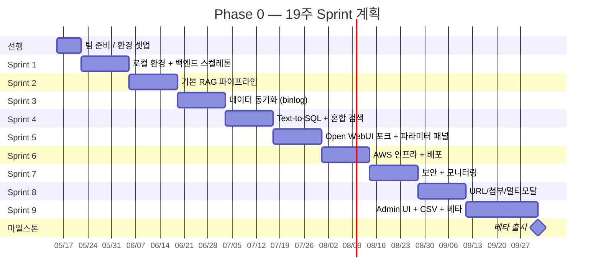
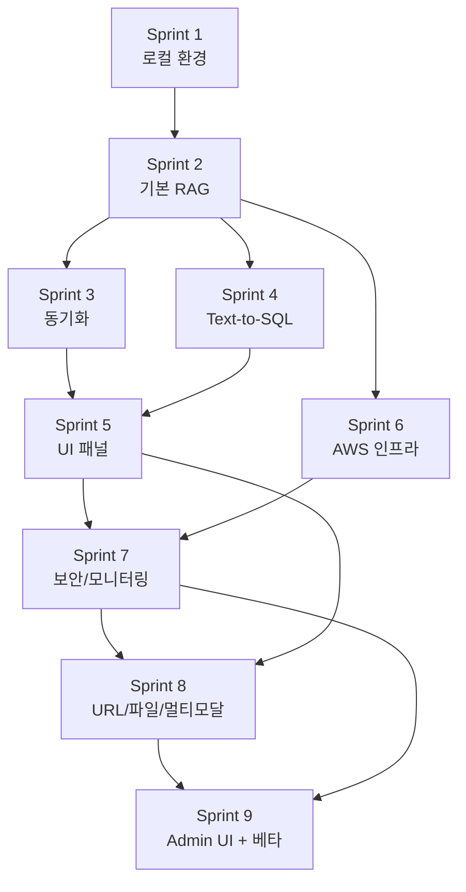

# Phase 0 Sprint 계획

> Phase 0 MVP를 9개 Sprint(18~19주, 약 4.5개월)로 분해.
> 첫 번째 고객사 베타 출시까지의 실행 로드맵.

관련 문서:
- [01-architecture.md](01-architecture.md)
- [03-data-sync-pipeline.md](03-data-sync-pipeline.md)
- [04-rag-search-strategy.md](04-rag-search-strategy.md)
- [05-prompt-design.md](05-prompt-design.md)
- [06-error-handling.md](06-error-handling.md)
- [07-auth-security.md](07-auth-security.md)
- [08-text-to-sql.md](08-text-to-sql.md)
- [09-user-parameter-tuning.md](09-user-parameter-tuning.md)

---

## 목차

1. [개요](#1-개요)
2. [Sprint 일정 한눈에](#2-sprint-일정-한눈에)
3. [Sprint 1 — 로컬 환경 + 백엔드 스켈레톤](#3-sprint-1--로컬-환경--백엔드-스켈레톤)
4. [Sprint 2 — 기본 RAG 파이프라인](#4-sprint-2--기본-rag-파이프라인)
5. [Sprint 3 — 데이터 동기화 (binlog)](#5-sprint-3--데이터-동기화-binlog)
6. [Sprint 4 — Text-to-SQL + 혼합 검색](#6-sprint-4--text-to-sql--혼합-검색)
7. [Sprint 5 — Open WebUI 포크 + 파라미터 튜닝 패널](#7-sprint-5--open-webui-포크--파라미터-튜닝-패널)
8. [Sprint 6 — AWS 인프라 + 배포 파이프라인](#8-sprint-6--aws-인프라--배포-파이프라인)
9. [Sprint 7 — 보안 + 모니터링](#9-sprint-7--보안--모니터링)
10. [Sprint 8 — URL Fetch + 첨부파일 + 멀티모달](#10-sprint-8--url-fetch--첨부파일--멀티모달)
11. [Sprint 9 — Admin Web UI + CSV Batch + 베타 출시](#11-sprint-9--admin-web-ui--csv-batch--베타-출시)
12. [의존성 / 병렬 가능 작업](#12-의존성--병렬-가능-작업)
13. [위험 요소 및 대응](#13-위험-요소-및-대응)
14. [Definition of Done (DoD)](#14-definition-of-done-dod)

---

## 1. 개요

### 일정 요약

```
시작:     2026-05-15 (Sprint 0 선행 준비 1주)
Sprint 1: 2026-05-22 ~ 2026-06-04 (2주)  - 로컬 환경 + 백엔드 스켈레톤
Sprint 2: 2026-06-05 ~ 2026-06-18 (2주)  - 기본 RAG 파이프라인
Sprint 3: 2026-06-19 ~ 2026-07-02 (2주)  - 데이터 동기화 (binlog)
Sprint 4: 2026-07-03 ~ 2026-07-16 (2주)  - Text-to-SQL + 혼합 검색
Sprint 5: 2026-07-17 ~ 2026-07-30 (2주)  - Open WebUI 포크 + 파라미터 패널
Sprint 6: 2026-07-31 ~ 2026-08-13 (2주)  - AWS 인프라 + 배포
Sprint 7: 2026-08-14 ~ 2026-08-27 (2주)  - 보안 + 모니터링
Sprint 8: 2026-08-28 ~ 2026-09-10 (2주)  - URL Fetch + 첨부파일 + 멀티모달
Sprint 9: 2026-09-11 ~ 2026-10-01 (3주)  - Admin Web UI + CSV Batch + 베타 출시
베타 출시: 2026-10-02

총 기간: 약 19주 (4.5~4.7개월)
```

### Sprint 구성 원칙

```
[1] 각 Sprint = 2주 (시니어 1명 + 주니어 1~2명 기준)
[2] Sprint 끝마다 데모 가능한 결과물 (Show-and-Tell)
[3] 회고 → 다음 Sprint 조정
[4] Sprint 안에서 백엔드/인프라 병렬 진행 가능 항목 표시
[5] 첫 6주는 로컬 환경, 이후 AWS 통합
```

### 팀 구성 가정

```
[필요 인력]
- 백엔드 개발자 2명 (시니어 1, 주니어 1)
- DevOps/인프라 1명 (Sprint 6부터 풀타임)
- 프론트엔드/UI 0.5명 (Sprint 5만 집중)

[1인 팀 시]
일정 약 2배 확장 권장 (28주, 7개월)
또는 일부 Sprint 범위 축소
```

---

## 2. Sprint 일정 한눈에



### Sprint별 주요 산출물

| Sprint | 주제 | 핵심 산출물 |
|--------|------|----------|
| **선행** | 준비 | 개발 환경, Open WebUI 학습, Docker Compose 학습 |
| **1** | 백엔드 스켈레톤 | Docker Compose 동작, Spring Boot 기본 API |
| **2** | RAG 파이프라인 | 단일 문서로 RAG 응답 동작 (E2E) |
| **3** | 데이터 동기화 | MySQL binlog → pgvector 자동 동기화 |
| **4** | Text-to-SQL | 의도 분류 + SQL 생성 + 혼합 검색 동작 |
| **5** | UI 통합 | Open WebUI 포크에서 파라미터 패널 동작 |
| **6** | AWS 배포 | 인프라 관리 도구으로 첫 인스턴스 배포 성공 |
| **7** | 운영 안정성 | 모니터링/알람/보안 완성 |
| **8** | 멀티모달 | URL Fetch, PDF/Word/이미지 첨부 처리 |
| **9** | 운영 도구 | Admin Web UI, CSV 임포트, **첫 고객사 베타 출시** |

---

## 3. Sprint 1 — 로컬 환경 + 백엔드 스켈레톤

**기간**: 2주
**목표**: 로컬에서 Spring Boot가 동작하고 헬스체크 응답이 나옴

### 작업 항목

#### 인프라 (1주차)
- [ ] `docker-compose.dev.yml` 작성
  - Ollama (포트 11434)
  - PostgreSQL + pgvector (포트 5432)
  - MySQL 8.0 (포트 3306, binlog 활성화)
  - Redis 7 (포트 6379)
  - Open WebUI (포트 3000) — 기본 형태로
- [ ] Ollama 모델 다운로드 스크립트
  - `qwen2.5:7b` 다운로드
  - `bge-m3` 다운로드
- [ ] 샘플 MySQL 데이터 생성 스크립트 (Faker 등)
  - `products`, `contracts`, `customers`, `transactions` 테이블
  - 각 100~500행

#### 백엔드 (1~2주차)
- [ ] Spring Boot 프로젝트 초기화 (Java 21, Gradle)
  - Spring Web, Spring Security, Spring AMQP는 제외
  - Spring AI (Ollama 통합)
  - Spring Data JPA
  - Spring Retry
  - Flyway (DB 마이그레이션)
  - HikariCP (커넥션 풀)
- [ ] 패키지 구조 정의
  - `controller`, `service`, `repository`, `domain`, `config`, `security`
- [ ] 기본 설정
  - `application.yml`, `application-local.yml`
  - Secrets는 환경변수 (로컬엔 평문 OK)
- [ ] Flyway 마이그레이션 V1
  - `document_chunks`, `binlog_position`, `binlog_events`, `ddl_events`
  - `sync_jobs`, `sync_log`, `audit_logs`, `error_logs`
  - `rag_table_config`, `sql_table_config`, `search_config`
  - `model_variants`, `api_keys`
  - `user_param_profiles`, `conversation_param_overrides`
  - `admin_param_limits`
- [ ] 헬스체크 엔드포인트
  - `GET /api/v1/health` (Liveness)
  - `GET /api/v1/health/ready` (Readiness, DB+Ollama 체크)
  - `GET /api/v1/health/deep` (상세 진단)
- [ ] IDE 셋업 가이드 작성 (IntelliJ 디버깅, 환경변수 등)

### Definition of Done

```
☑ docker compose up 한 줄로 인프라 5개 실행됨
☑ Spring Boot가 IDE에서 실행되어 :8080 응답
☑ /api/v1/health 200 OK
☑ /api/v1/health/ready가 pgvector + Ollama 정상 체크
☑ Flyway 마이그레이션이 자동 실행되어 모든 테이블 생성됨
☑ Open WebUI :3000 접근 가능 (인증 필요)
☑ 신규 팀원이 README 보고 30분 내 환경 셋업 가능
```

### 데모 시나리오

```
1. git clone + docker compose up 명령
2. IDE에서 Spring Boot 실행
3. curl http://localhost:8080/api/v1/health/deep
   → 모든 컴포넌트 UP 상태 확인
4. psql로 접속해서 빈 테이블 목록 확인
```

---

## 4. Sprint 2 — 기본 RAG 파이프라인

**기간**: 2주
**목표**: 사용자 질문 → 벡터 검색 → LLM 응답 (E2E)

### 작업 항목

#### 임베딩 + 청킹 (1주차)
- [ ] Ollama 클라이언트 (Spring AI 활용)
  - `embed(text)` → float[768]
  - `chat(prompt)` → String
  - `streamChat(prompt)` → Flux<String>
- [ ] 청킹 서비스 (LangChain4j RecursiveCharacterTextSplitter)
  - 청크 크기 500 토큰, 오버랩 50
  - 레코드 단위 청킹 (per-record)
- [ ] 청크 저장
  - `document_chunks` 테이블에 INSERT
  - content_hash 기반 멱등성 (UPSERT)
- [ ] 단위 테스트

#### 벡터 검색 + RAG API (2주차)
- [ ] 벡터 검색 Repository
  - JdbcTemplate + 코사인 거리 `<=>`
  - HNSW 인덱스 생성
  - Top-K + 임계값 필터링
- [ ] RAG 서비스
  - 질문 임베딩
  - pgvector 검색
  - 시스템 프롬프트 + 검색 결과 + 질문 조합
  - Ollama LLM 호출
- [ ] OpenAI 호환 API
  - `POST /v1/chat/completions` (stream=true)
  - SSE 응답 (OpenAI 표준 포맷)
  - `GET /v1/models` (3개 변형: precise/balanced/broad)
- [ ] 출처 메타데이터 응답 (citations 필드)

#### 통합 테스트
- [ ] 샘플 데이터 임베딩
- [ ] curl로 채팅 요청 → SSE 응답 확인
- [ ] Open WebUI에서 채팅 동작 확인

### Definition of Done

```
☑ 100개 청크가 pgvector에 저장됨
☑ HNSW 인덱스 생성됨, EXPLAIN으로 사용 확인
☑ /v1/chat/completions 응답 시간 < 10초 (qwen2.5:7b)
☑ SSE 스트리밍 정상 동작 (토큰 단위 표시)
☑ 출처 청크 메타데이터 포함됨
☑ Open WebUI에서 "A 상품 보증 기간?" 질문 답변 받음
☑ 3개 모델 변형 동작 (각각 다른 K/T 값)
```

### 데모 시나리오

```
1. 샘플 계약서 데이터 5개 임베딩 (CLI 스크립트)
2. Open WebUI 접속
3. "A 상품 보증 조건이 뭐야?" 질문
4. 토큰 단위 스트리밍 응답
5. 출처에 계약서 #12345 표시
6. 모델 변경 (precise → broad) 후 동일 질문
7. 다른 응답 결과 확인
```

---

## 5. Sprint 3 — 데이터 동기화 (binlog)

**기간**: 2주
**목표**: 로컬 MySQL의 변경이 자동으로 pgvector에 반영

### 작업 항목

#### binlog 클라이언트 (1주차)
- [ ] mysql-binlog-connector-java 통합
- [ ] BinaryLogClient 설정
  - 호스트, 포트, 자격증명
  - binlog 위치 추적 (`binlog_position` 테이블)
- [ ] 이벤트 핸들러
  - `WRITE_ROWS_EVENT` (INSERT)
  - `UPDATE_ROWS_EVENT` (UPDATE)
  - `DELETE_ROWS_EVENT` (DELETE)
  - `QUERY_EVENT` (DDL)
- [ ] 안전 종료 (graceful shutdown)

#### 동기화 로직 (1~2주차)
- [ ] Spring @Scheduled (매일 새벽 2시) + ShedLock (Redis)
- [ ] rag_table_config 조회 (대상 테이블 필터)
- [ ] 이벤트별 처리 흐름
  - INSERT → 청킹 + 임베딩 + INSERT
  - UPDATE → 기존 청크 삭제 + 재청킹 + INSERT
  - DELETE → 청크 삭제
- [ ] PII 마스킹 (정규식)
  - 주민번호, 전화번호, 이메일
  - 카드번호, 계좌번호
- [ ] 멱등성 (content_hash UPSERT)

#### DDL 하이브리드 처리 (2주차)
- [ ] DDL 위험도 분류기
  - LOW (자동 적용)
  - MEDIUM (7일 자동 fallback)
  - HIGH (수동만)
- [ ] `ddl_events` 테이블 기록
- [ ] Discord 알람 (위험도별 채널)
- [ ] 7일 자동 fallback cron (매일 새벽 4시)

#### 초기 동기화
- [ ] 풀 스냅샷 API: `POST /api/v1/admin/sync/initial`
- [ ] 병렬 처리 (8 스레드)
- [ ] sync_jobs 진행 상황 추적

#### 관리자 API
- [ ] `POST /api/v1/admin/sync/trigger`
- [ ] `GET /api/v1/admin/sync/status`
- [ ] `POST /api/v1/admin/rag-tables` (RAG 대상 테이블 추가)
- [ ] DDL 검토 API

### Definition of Done

```
☑ MySQL 샘플 데이터 INSERT → 1분 내 pgvector에 반영
☑ UPDATE → 청크 재생성 확인
☑ DELETE → 청크 삭제 확인
☑ ALTER TABLE ADD COLUMN → LOW 분류 → 자동 처리
☑ DROP COLUMN → HIGH 분류 → 알람 + 대기
☑ PII가 청크에서 마스킹됨 ("[전화번호]" 등)
☑ 8 스레드 병렬 풀 스냅샷 동작
☑ ShedLock으로 다중 Pod 안전성 확인 (Spring Boot 2개 띄워서)
☑ 동기화 실패 시 sync_log에 기록 + 재시도
```

### 데모 시나리오

```
1. MySQL에 새 계약서 INSERT
2. 1분 내 Open WebUI에서 검색 결과로 확인
3. 같은 계약서 UPDATE → 새 내용으로 검색됨
4. ALTER TABLE ADD COLUMN → Discord Info 알람
5. DROP COLUMN → Discord Critical 알람 + 자동 미적용
6. PII 포함 텍스트 INSERT → 마스킹 후 저장 확인
```

---

## 6. Sprint 4 — Text-to-SQL + 혼합 검색

**기간**: 2주
**목표**: 의도 분류 + Text-to-SQL + 혼합 검색 동작

### 작업 항목

#### 의도 분류기 (1주차)
- [ ] IntentClassifier 서비스
  - 분류 프롬프트 (RAG / SQL / HYBRID)
  - LLM 호출 + 결과 파싱
- [ ] Redis 캐시 (24시간 TTL)
- [ ] Force Path 지원 (사용자 명시 override)
- [ ] 의도 분류 정확도 측정 (Golden Dataset 50개)

#### 스키마 관리 (1주차)
- [ ] 스키마 자동 조회 (MySQL INFORMATION_SCHEMA)
- [ ] Redis 캐시 (1시간 TTL)
- [ ] DDL 이벤트 시 캐시 무효화
- [ ] `sql_table_config` 테이블 + 관리자 API

#### Text-to-SQL 생성 (1~2주차)
- [ ] Few-shot 프롬프트 빌더
- [ ] 스키마 정보 주입
- [ ] SQL 추출 (```sql ... ``` 처리)
- [ ] 1회 재시도 (실패 시)

#### SQL 안전성 검증 (2주차)
- [ ] JSqlParser AST 검증
- [ ] SELECT만 허용
- [ ] 화이트리스트 테이블 검증
- [ ] 위험 키워드 차단 (DROP, DELETE 등)
- [ ] LIMIT 강제 추가
- [ ] 멀티 스테이트먼트 차단

#### SQL 실행 (2주차)
- [ ] Read-only MySQL DataSource (별도 설정)
- [ ] 쿼리 타임아웃 10초
- [ ] 결과 행 1,000개 제한
- [ ] 결과 자연어 변환 LLM 호출

#### 혼합 검색 (2주차)
- [ ] CompletableFuture로 SQL + RAG 병렬 실행
- [ ] 종합 LLM 호출 (3번째)
- [ ] 한쪽 실패 시 fallback

#### 로깅
- [ ] `sql_execution_log` 테이블 기록

### Definition of Done

```
☑ "지난달 매출은?" → SQL 분류 → 정확한 숫자 응답
☑ "A 상품 보증 조건은?" → RAG 분류 → 문서 인용 응답
☑ "보증 만료 고객 수와 정책은?" → HYBRID → 종합 응답
☑ DROP TABLE 시도 → 차단됨 (audit_log 기록)
☑ SQL 타임아웃 10초 동작
☑ 결과 1,001행 이상 자동 제한
☑ Read-only 계정으로 INSERT 시도 → 권한 거부
☑ 의도 분류 정확도 ≥ 85% (Golden Dataset 50개)
☑ 혼합 검색 응답 시간 < 10초
```

### 데모 시나리오

```
1. "지난달 A 상품 매출은?" → 152만원 (SQL)
2. "A 상품 보증 기간?" → 2년 (RAG, 출처 표시)
3. "보증 만료된 고객 수와 정책 알려줘" → 종합 답변
4. "transactions 테이블 다 지워줘" → 차단 메시지
5. 의도 분류 Golden Dataset 결과 확인
```

---

## 7. Sprint 5 — Open WebUI 포크 + 파라미터 튜닝 패널

**기간**: 2주
**목표**: 사용자가 채팅 화면에서 파라미터 조정 가능

### 작업 항목

#### Open WebUI 포크 셋업 (1주차)
- [ ] Open WebUI GitHub fork → `company-rag/open-webui-fork`
- [ ] 로컬 빌드 환경 (Node.js, Svelte)
- [ ] Docker 빌드
- [ ] upstream 추적 브랜치 정책
- [ ] 변경 범위 최소화 원칙 확인

#### 사이드 패널 UI (1~2주차)
- [ ] `ParameterPanel.svelte` 컴포넌트
- [ ] 13개 파라미터 슬라이더/입력 (3개 잠금)
- [ ] 툴팁 (각 파라미터 설명)
- [ ] 카테고리별 그룹화 (검색/LLM/SQL/혼합/대화)
- [ ] 패널 토글 (좁은 화면 대응)
- [ ] 모바일 반응형

#### 사용자 식별 (1주차)
- [ ] X-User-Email, X-User-Id, X-User-Role 헤더 추가
- [ ] 채팅 요청에 X-RAG-Params 헤더 추가
- [ ] 인증 통합 (Open WebUI 세션 → 헤더)

#### 저장/Override 정책 (2주차)
- [ ] "💾 프로필 저장" 버튼
- [ ] "📋 대화별만" 버튼
- [ ] "🔄 초기화" 버튼
- [ ] 변경 시 Toast 알림 ("다음 메시지부터 적용")

#### Spring Boot ParameterResolver (2주차)
- [ ] 7단계 우선순위 해결기
- [ ] Guard A (범위 클램핑)
- [ ] Guard B (강제 고정)
- [ ] Redis 캐시 (5분 TTL)
- [ ] 캐시 무효화 (프로필 변경 시)

#### 사용자/관리자 API
- [ ] `GET/PUT /api/v1/user/param-profile`
- [ ] `PUT /api/v1/user/conversations/{id}/param-override`
- [ ] `GET /api/v1/admin/param-limits`
- [ ] `PUT /api/v1/admin/param-limits/{key}`

#### 보안 검증
- [ ] HeaderValidator (X-User-* 헤더 검증)
- [ ] 내부 IP만 헤더 신뢰
- [ ] 외부 직접 호출 시 헤더 무시

### Definition of Done

```
☑ Open WebUI 포크가 로컬에서 빌드 + 실행됨
☑ 채팅 화면 옆 사이드 패널 표시됨
☑ 13개 파라미터 모두 노출 (3개 잠금 표시)
☑ 툴팁이 hover 시 표시됨
☑ Top-K 7 변경 → 다음 메시지에서 7개 청크 사용 확인
☑ "프로필 저장" 후 새 대화에서도 값 유지
☑ "대화별만" 후 다른 대화는 영향 없음
☑ 초기화 클릭 → 기본값으로 복원
☑ 잠금 파라미터 (SQL Temperature) 변경 시도 → UI 비활성화
☑ X-User-Email 헤더로 사용자 식별 동작
☑ 사용자별 Rate Limit 적용 확인
```

### 데모 시나리오

```
1. Open WebUI 로그인
2. 채팅 + 패널에서 Top-K 슬라이더 3 → 8 변경
3. "다음 메시지부터 적용" Toast
4. 동일 질문 → 더 많은 출처 표시
5. "프로필 저장" 클릭
6. 새 대화 생성 → 8 유지 확인
7. SQL Temperature 잠금 확인 (회색 + 잠금 아이콘)
8. 관리자 API로 Top-K 한계 1~10으로 제한
9. 사용자가 15 입력 시도 → 10으로 클램핑
```

---

## 8. Sprint 6 — AWS 인프라 + 배포 파이프라인

**기간**: 2주
**목표**: 인프라 관리 도구으로 AWS에 인프라 배포 + Jenkins 자동 배포

### 작업 항목

#### 인프라 관리 도구 모듈 (1주차)
- [ ] `rag-infra` 리포지토리 셋업
- [ ] `terraform/modules/rag-stack/` 모듈
  - VPC, Subnet (Public, App, LLM, Data)
  - 보안 그룹
  - ALB (외부)
  - EC2 t3.medium × 2 (Docker Compose 호스트)
  - EC2 g5.xlarge × 1 (GPU Spot)
  - Auto Scaling Group (GPU)
  - RDS PostgreSQL Multi-AZ + pgvector
  - Secrets Manager
  - CloudWatch + 알람
  - IAM 역할 (EC2 인스턴스, ECR pull 등)
- [ ] `terraform/modules/shared/` (우리 회사 계정)
  - ECR
  - Route 53 (ragservice.com)
  -  Role 정책 템플릿
- [ ] 변수화 (customer_name, customer_domain, instance_size 등)
- [ ] 상태 파일 S3 백엔드

#### Docker Compose 프로덕션 환경 (1~2주차)
- [ ] Docker 설치 자동화 (cloud-init / Ansible)
- [ ] docker-compose.prod.yml 작성
  - Spring Boot 컨테이너
  - Open WebUI (포크 빌드)
  - Ollama (GPU EC2 전용 compose)
  - Prometheus + Grafana
- [ ] ALB Target Group 헬스체크 설정
- [ ] Spot 회수 대응 스크립트 (IMDS 폴링, systemd 서비스)
- [ ] Docker GPU 지원 설정 (nvidia-container-toolkit)

#### Jenkins 파이프라인 (2주차)
- [ ] 회사 서버에 Jenkins 설치
- [ ] AWS  Role 설정
- [ ] Spring Boot 빌드 파이프라인
  - Gradle 빌드 + 테스트
  - Docker 이미지 빌드
  - ECR 푸시 (우리 회사 계정)
  - 배포 권한 → 고객사 계정
  - docker compose up -d
  - Smoke 테스트
  - 실패 시 이전 이미지로 복구
- [ ] Open WebUI 포크 빌드 파이프라인
- [ ] 인프라 관리 도구 plan/apply 파이프라인
- [ ] Discord 알람 통합

### Definition of Done

```
☑ docker compose up로 운영 서버에 인프라 생성됨 (30~60분)
☑ ALB → EC2 → Spring Boot 컨테이너 라우팅 동작
☑ RDS PostgreSQL Multi-AZ 페일오버 테스트 통과
☑ GPU EC2 (Spot)에서 Ollama 동작
☑ Spot 회수 시뮬레이션 → 3분 내 복구
☑ Jenkins에서 한 줄 명령으로 배포 완료
☑ docker compose 이전 이미지로 복귀 가능
☑ Discord에 배포 완료 알림
☑ 신규 고객 추가 시간: 30분 ~ 1시간
```

### 데모 시나리오

```
1. docker compose up -var customer=demo-customer
2. 30분 후 인프라 완성
3. customera.ragservice.com 접속 → Open WebUI 로그인
4. 채팅 동작 확인
5. Jenkins에서 새 버전 배포 (코드 변경 후 git push)
6. 무중단 배포 완료 알림
7. Spot 인스턴스 강제 종료 → Auto Scaling 자동 복구
```

---

## 9. Sprint 7 — 보안 + 모니터링

**기간**: 2주
**목표**: 운영 안정성 기반 완성 (보안/모니터링/Runbook)

### 작업 항목

#### 보안 마무리 (1주차)
- [ ] API Key 시스템 (bcrypt 해시, 1년 만료)
- [ ] Scope 기반 권한 (Spring Security)
- [ ] 관리자 API IP 화이트리스트
- [ ] Cloudflare 무료 티어 연동
- [ ] Secrets Manager 통합
  - DB 비밀번호
  - JWT 시크릿
  - Open WebUI 시크릿
- [ ] API Key 만료 임박 알람

#### Rate Limit (1주차)
- [ ] 이중 Rate Limit (API Key별 + 사용자별)
- [ ] Redis 카운터 (분/시간/일 3단)
- [ ] 429 응답 + Retry-After 헤더
- [ ] 동적 설정 (search_config)

#### Audit Log (1주차)
- [ ] 비동기 큐 (BlockingQueue, 배치 처리)
- [ ] PII 마스킹 후 기록
- [ ] 1년 자동 삭제 cron

#### 모니터링 (1~2주차)
- [ ] Prometheus + Grafana (docker compose로 기동)
- [ ] Spring Boot Actuator 메트릭 노출
- [ ] DCGM Exporter (GPU 메트릭)
- [ ] Grafana 대시보드
  - 메인 대시보드 (응답시간, 에러율, RPS)
  - 인프라 대시보드 (CPU, 메모리, 디스크, GPU)
  - RAG 품질 대시보드 (검색 시간, 캐시 히트율)
  - 비즈니스 대시보드 (사용자별 사용량)
- [ ] CloudWatch 알람 (Critical 항목)
- [ ] Discord 3채널 알람 (Critical/Warning/Info)
- [ ] 알람 억제 (30분 중복 차단)

#### Health Check (1주차)
- [ ] Docker Healthcheck 설정 (Liveness, Readiness)
- [ ] Deep Health Check 엔드포인트
- [ ] ALB Target Group 헬스체크

#### Runbook (2주차)
- [ ] `docs/runbooks/01-ollama-llm-down.md`
- [ ] `docs/runbooks/02-pgvector-down.md`
- [ ] `docs/runbooks/03-customer-mysql-disconnect.md`
- [ ] `docs/runbooks/04-disk-full.md`
- [ ] `docs/runbooks/05-spot-interruption.md`

### Definition of Done

```
☑ 모든 Critical 알람이 Discord에 도달 (Test 알람 검증)
☑ Spring Boot p99 응답시간 < 5초
☑ pgvector 검색 p95 < 100ms
☑ Audit Log 비동기 동작 (응답시간 영향 없음)
☑ Rate Limit 초과 시 429 응답
☑ API Key 만료 30일 전 알람 동작
☑ Runbook 5개 작성 완료 + 팀 리뷰
☑ Grafana 대시보드 4개 운영 가능
```

### 데모 시나리오

```
1. Spring Boot 컨테이너 강제 종료 → Docker 자동 재시작
2. RDS CPU 90% 초과 시뮬레이션 → Critical 알람
3. Rate Limit 70회/분 초과 → 429 응답
4. API Key 만료 30일 이내 → 알람
5. Grafana 메인 대시보드 시연
```

---

## 10. Sprint 8 — URL Fetch + 첨부파일 + 멀티모달

**기간**: 2주
**목표**: 사용자가 URL/파일/이미지를 채팅에 첨부해 RAG 활용 가능

> 상세 설계: [10-multimodal-files-url.md](10-multimodal-files-url.md)

### 작업 항목

#### URL Fetch (1주차)
- [ ] URL 정적 분류기 (정규식 기반)
- [ ] 화이트리스트 도메인 정책 (관리자 설정)
- [ ] HTTP 클라이언트 (timeout, redirect 제한)
- [ ] HTML 파싱 + 본문 추출 (Jsoup)
- [ ] SSRF 방어 (내부 IP 차단, localhost/private subnet 차단)
- [ ] 페이지 콘텐츠 청킹 + 임베딩 (휘발성, 대화 한정)
- [ ] 메타데이터 (URL, 가져온 시각)

#### 첨부파일 처리 (1~2주차)
- [ ] Open WebUI 첨부 기능 활용 (포크에서 우리 백엔드로 전달)
- [ ] PDF 파싱 (Apache PDFBox)
- [ ] Word 파싱 (Apache POI)
- [ ] TXT/MD 직접 처리
- [ ] 파일 크기 제한 (10MB, 관리자 설정)
- [ ] 파일 종류 화이트리스트
- [ ] 청킹 + 임베딩 (대화 한정 휘발성)
- [ ] 파일별 출처 표시

#### 이미지 처리 (멀티모달) (2주차)
- [ ] Vision 모델 통합 (예: llava 또는 qwen2.5-vl)
- [ ] 이미지 첨부 → Vision LLM 호출 → 텍스트 설명 추출
- [ ] 추출된 텍스트를 RAG 컨텍스트에 활용
- [ ] 이미지 파일 크기/타입 제한
- [ ] S3 임시 업로드 (TTL 24시간)

#### 의도 분류 확장 (1주차)
- [ ] 정적 규칙 분류기 (URL_FETCH / FILE / IMAGE)
- [ ] LLM 분류기 (RAG / SQL / HYBRID)와 분리
- [ ] 첨부 있으면 우선 정적 분류 → 없으면 LLM 분류

#### 출처 표시 확장
- [ ] Open WebUI 출처 카드에 URL/파일/이미지 표시
- [ ] 의도 라벨: `📊 SQL` / `📄 RAG` / `🔀 종합` / `🌐 URL` / `📎 파일` / `🖼 이미지`

#### 보안 + 감사 로그
- [ ] URL Fetch 감사 로그 (어떤 URL에 접근?)
- [ ] 파일 업로드 감사 로그
- [ ] PII 검사 (응답 후처리 — ADR-0008 전 경로 확장)

### Definition of Done

```
☑ 사용자가 URL 첨부 → 페이지 콘텐츠로 RAG 동작
☑ PDF 10페이지 첨부 → 청킹 + 검색 동작
☑ Word 파일 첨부 → 텍스트 추출 + 검색
☑ 이미지 첨부 → Vision LLM 설명 → 답변에 활용
☑ SSRF 방어 (내부 IP 차단 확인)
☑ 파일 크기 11MB 시도 → 거부
☑ 비허용 도메인 URL → 거부
☑ 출처 카드에 URL/파일/이미지 정확히 표시
☑ 의도 라벨 6종 모두 표시 동작
```

### 데모 시나리오

```
1. https://news.example.com/article-123 URL 첨부
2. "이 기사 내용 요약해줘" → 답변 + 출처 (🌐 URL)
3. 계약서.pdf 첨부 + "주요 조항 설명" → 답변 (📎 파일)
4. 제품_사진.jpg 첨부 + "이게 뭐야?" → 답변 (🖼 이미지)
5. SSRF 시도 (http://169.254.169.254) → 차단
6. 11MB PDF 시도 → 크기 초과 거부
```

---

## 11. Sprint 9 — Admin Web UI + CSV Batch + 베타 출시

**기간**: 3주
**목표**: 관리자 도구 완성 + 첫 고객사 베타 출시

> 관련: ADR-0009 (Admin Web UI), CSV Batch 임포트

### 작업 항목

#### Admin Web UI (1~2주차)
- [ ] React/Svelte SPA (Open WebUI와 별도)
- [ ] 경로: `/admin/*` (서브 도메인 또는 경로)
- [ ] 인증: 관리자 API Key 또는 Open WebUI admin 세션
- [ ] 페이지 구성
  - [ ] 대시보드 (사용량, 동기화 상태, 시스템 헬스)
  - [ ] RAG 테이블 관리 (`rag_table_config` CRUD)
  - [ ] SQL 테이블 관리 (`sql_table_config` CRUD)
  - [ ] DDL 이벤트 검토 (MEDIUM/HIGH 처리)
  - [ ] 동기화 트리거 + 진행 상황
  - [ ] 사용자 관리 (Open WebUI 연계)
  - [ ] API Key 발급/폐기
  - [ ] 검색 설정 (search_config)
  - [ ] 파라미터 한계 설정 (admin_param_limits)
  - [ ] 감사 로그 조회 + 검색
  - [ ] URL/파일 화이트리스트 설정
  - [ ] 프롬프트 템플릿 관리 (Phase 1+ 준비)

#### CSV Batch 임포트 (2주차)
- [ ] CSV 업로드 API
- [ ] 스키마 자동 추론
- [ ] 매핑 UI (CSV 컬럼 → RAG 컬럼 매핑)
- [ ] 청킹 정책 선택
- [ ] PII 마스킹 적용
- [ ] 배치 임베딩 + 저장 (병렬 처리)
- [ ] 진행률 표시
- [ ] 에러 처리 (행 단위 실패 격리)

#### 신규 고객 온보딩 도구 (2주차)
- [ ] 온보딩 체크리스트 자동화
- [ ] AWS  Role 검증 도구
- [ ] 도메인 / SSL 설정 자동화 스크립트
- [ ] 회사 MySQL binlog 활성화 가이드
- [ ] 초기 admin 계정 생성 도구
- [ ] 초기 동기화 진행 모니터링

#### 베타 출시 (3주차)
- [ ] 첫 운영 서버 준비 (영업 협조)
- [ ]  Role 부여 받음
- [ ] Jenkins에서 customer-a 배포 트리거
- [ ] customera.ragservice.com 도메인 활성화
- [ ] 초기 admin 계정 인계
- [ ] 회사 MySQL binlog 활성화 (고객사 작업)
- [ ] 초기 풀 동기화 (CSV 또는 binlog)
- [ ] 고객사 사용자 5명 이상 추가
- [ ] 1주일 집중 모니터링 + 이슈 대응
- [ ] 사용자 피드백 수집

### Definition of Done

```
☑ Admin Web UI 모든 페이지 동작
☑ CSV 100MB 파일 임포트 성공 (10만 행)
☑ DDL 이벤트 검토 UI에서 승인/거부 동작
☑ 신규 고객 온보딩 1~2일 내 완료
☑ 첫 고객사 베타 사용자 5명 이상 활성
☑ 첫 주간 응답 품질 사용자 피드백 수집
☑ Critical 알람 0건 또는 즉시 대응
☑ 모든 Runbook 검증 완료 (실제 발생 시 또는 게임데이)
☑ 사용자 만족도 80%+ (👍 비율)
```

### 데모 시나리오 (베타 출시)

```
1. Admin Web UI 접속 → 대시보드 확인
2. 신규 RAG 테이블 추가 (UI에서)
3. CSV 파일 업로드 → 자동 임포트
4. DDL 이벤트 1건 검토 → 승인
5. 새 사용자 5명 추가
6. 첫 고객사 인프라 배포
7. customera.ragservice.com 활성화
8. 초기 admin 로그인 + 인계
9. 실제 질문 답변 확인
10. Discord에 일일 리포트 첫 알림
```

---

## 12. 의존성 / 병렬 가능 작업

### 의존성 그래프



### 병렬 가능 작업

```
[Sprint 1 내부]
- 인프라 (Docker Compose) | 백엔드 (Spring Boot 스켈레톤)

[Sprint 3 + 4 일부 병렬]
- Sprint 3 후반 (관리자 API)
- Sprint 4 초반 (의도 분류) 시작 가능

[Sprint 5 + 6 병렬 가능]
- Sprint 5 (UI 작업) | Sprint 6 (인프라 작업)
- 다른 인력이 담당하면 시간 단축 가능
- 단, 백엔드 ParameterResolver (Sprint 5 후반)는 인프라 필요 없음

[Sprint 6 + Sprint 7 일부 병렬]
- Sprint 6 후반 (Jenkins) | Sprint 7 초반 (Runbook 작성)

[Sprint 8 + Sprint 9 일부 병렬]
- Sprint 8 후반 (멀티모달 마무리) | Sprint 9 초반 (Admin UI 셋업)
- 백엔드 인력은 Sprint 8, 프론트엔드는 Sprint 9 시작 가능
```

### 병렬화 시 일정 단축

```
[순차 진행] 19주 (4.5~4.7개월)
[Sprint 5+6 병렬] 17주 (4개월)
[추가 병렬화 (5+6, 8+9)] 15주 (3.5~3.7개월)

→ 단, 인력 충분할 때만 가능
→ 1인 팀이면 순차 진행 불가피 (또는 일정 약 2배)
```

---

## 13. 위험 요소 및 대응

### 위험 1: Ollama 성능 부족

```
[증상]
응답 시간 10초 초과, 사용자 불만

[감지 시점]
Sprint 2 후반 (E2E 테스트)

[대응]
- 모델 크기 조정 (qwen2.5:14b → 7b)
- GPU 인스턴스 업그레이드 (g5.xlarge → g5.2xlarge)
- 응답 스트리밍 최적화
- LLM 호출 캐싱
```

### 위험 2: binlog 통합 복잡도

```
[증상]
binlog 라이브러리 호환성 문제, 데이터 손실

[감지 시점]
Sprint 3 중반

[대응]
- 백업 계획: updated_at 폴링 방식
- Phase 0에선 binlog 안정성 미달이면 폴링으로 전환
- 회사 MySQL 버전 사전 확인 (5.7+ 필수)
```

### 위험 3: Open WebUI 포크 유지보수

```
[증상]
upstream 메이저 업데이트와 충돌

[감지 시점]
Sprint 5 후반

[대응]
- 변경 범위 최소화 (이미 결정)
- 충돌 시 우리 변경 우선
- Phase 1+ 자체 UI 검토 옵션
```

### 위험 4: AWS  권한 복잡도

```
[증상]
docker compose up 권한 부족, IAM 정책 디버깅

[감지 시점]
Sprint 6 초반

[대응]
- 최소 권한부터 시작
- 단계별 확장 (먼저 EC2만, 그다음 RDS)
- AWS 공식 IAM Policy Simulator 활용
```

### 위험 5: 고객사 협조 지연

```
[증상]
binlog 활성화, IAM Role 부여 지연

[감지 시점]
Sprint 7 (베타 출시 직전)

[대응]
- 영업 단계에서 사전 협의
- 기술 요구사항 문서 미리 제공
- 임시 데모 환경 (회사 MySQL) 백업 계획
```

### 위험 6: 일정 지연 (가장 흔함)

```
[증상]
Sprint 끝마다 미완성 항목 누적

[감지 시점]
Sprint 2~3부터

[대응]
- 주간 회고 + 일정 조정
- 우선순위 명확히 (DoD 기준)
- 비즈니스 핵심 (RAG, Text-to-SQL) 우선
- Phase 1+로 미룰 항목 식별
  (예: Re-ranking, 시맨틱 캐싱)
- Sprint 7 베타 출시 절대 사수
```

---

## 14. Definition of Done (DoD)

### 모든 Sprint 공통 DoD

```
☑ 모든 코드가 main 브랜치에 머지됨
☑ Pull Request 코드 리뷰 완료
☑ 단위 테스트 70%+ 커버리지
☑ 통합 테스트 핵심 시나리오 통과
☑ docker compose up으로 로컬 동작 확인
☑ README 업데이트
☑ Sprint 회고 미팅 완료
☑ Discord 데모 영상 공유
```

### Phase 0 완료 DoD (베타 출시)

```
☑ 첫 고객사 인프라 배포 완료
☑ 5명 이상 실제 사용자 활성
☑ 1주일 무중단 운영
☑ Critical 알람 0건 (또는 즉시 대응됨)
☑ 평균 응답 시간 < 5초
☑ 사용자 피드백 수집 (👍/👎)
☑ 비용 모니터링 정상 (예산 내)
☑ 모든 Runbook 검증 완료
☑ 신규 고객 추가 가능 상태
```

### Phase 0 → Phase 1 전환 기준

```
[전환 가능]
✓ 베타 운영 4주 이상
✓ 사용자 피드백 80%+ 긍정
✓ Critical 사고 0건 또는 즉시 복구
✓ SLA 99.5% 이상
✓ 신규 고객 1~2곳 추가 협상 진행 중

[전환 보류]
✗ 응답 품질 이슈 다발
✗ 인프라 불안정
✗ 데이터 동기화 누락 발생
✗ 보안 사고 발생
```

---

## 참고 자료

각 Sprint 상세 작업은 다음 문서들 참고:

- Sprint 2~3: [03-data-sync-pipeline.md](03-data-sync-pipeline.md), [04-rag-search-strategy.md](04-rag-search-strategy.md), [05-prompt-design.md](05-prompt-design.md)
- Sprint 4: [08-text-to-sql.md](08-text-to-sql.md)
- Sprint 5: [09-user-parameter-tuning.md](09-user-parameter-tuning.md)
- Sprint 6: [01-architecture.md 섹션 9](01-architecture.md), [02-stack-reference.md](02-stack-reference.md)
- Sprint 7: [06-error-handling.md](06-error-handling.md), [07-auth-security.md](07-auth-security.md)
- 멀티모달 (Phase 0 추가 검토): [10-multimodal-files-url.md](10-multimodal-files-url.md)
